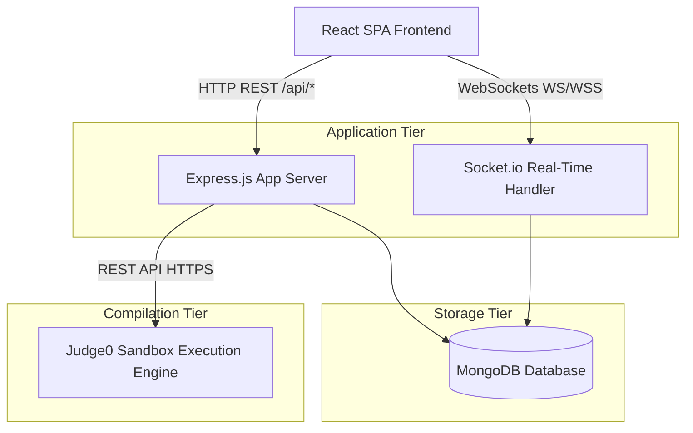
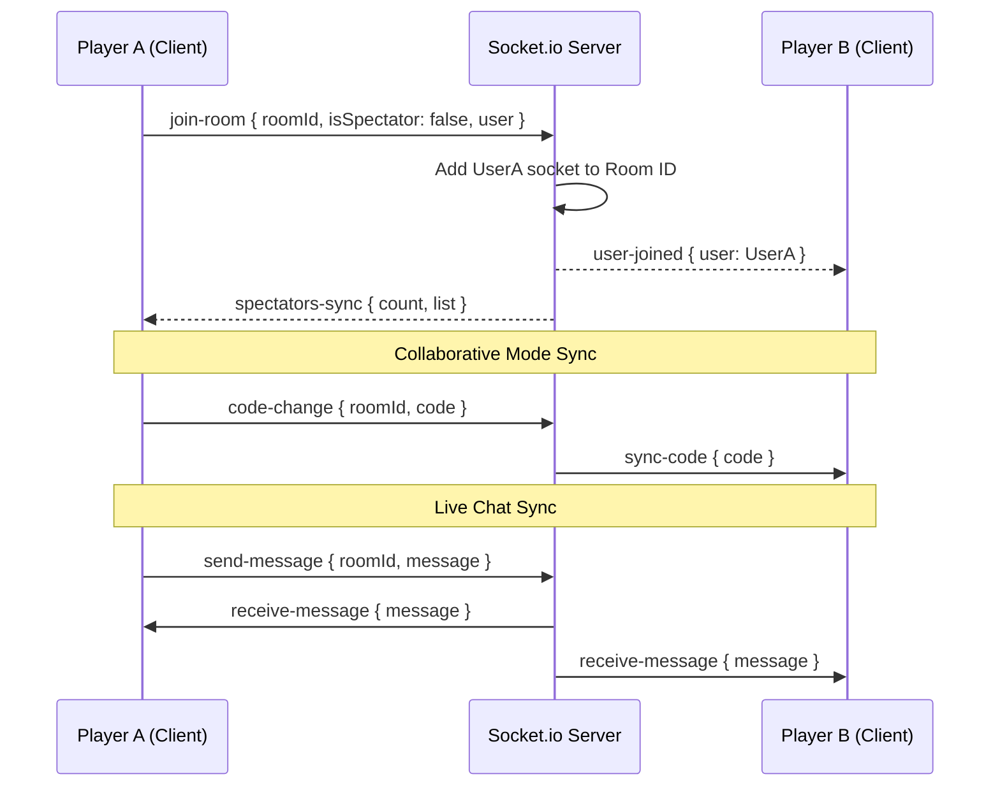
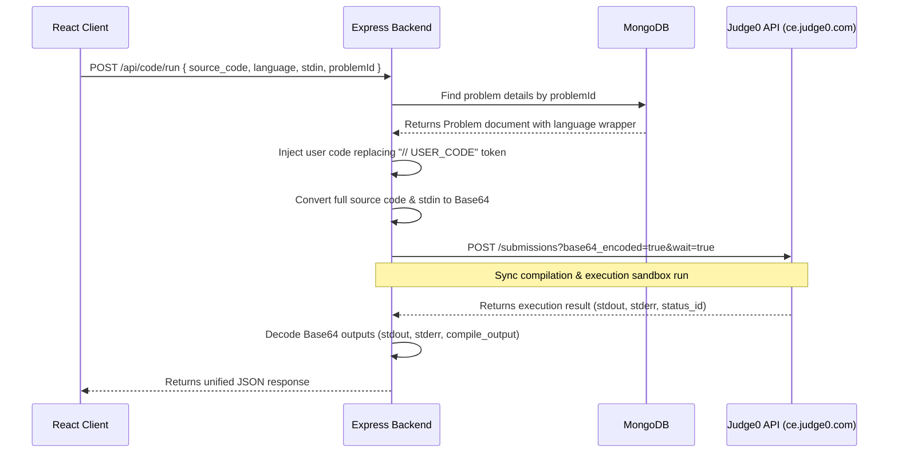
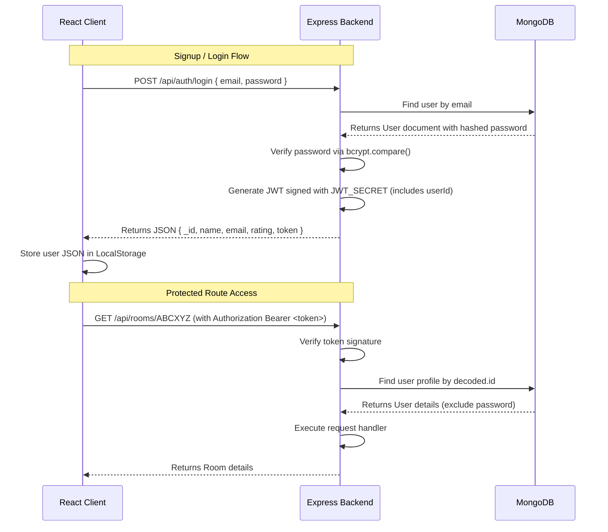

# AlgoSync - Senior Developer Interview Handbook

*Prepared for technical interviews at top-tier tech companies (Google, Microsoft, Amazon, Meta, Uber, Stripe).*

## Table of Contents

- [Project Overview](#project-overview)
- [Elevator Pitch](#elevator-pitch)
- [System Architecture](#system-architecture)
- [Folder Structure](#folder-structure)
- [Frontend Deep Dive](#frontend-deep-dive)
- [Backend Deep Dive](#backend-deep-dive)
- [Database](#database)
- [Socket Io](#socket-io)
- [Judge0 Integration](#judge0-integration)
- [Authentication](#authentication)
- [Apis](#apis)
- [Important Technologies](#important-technologies)
- [Design Decisions](#design-decisions)
- [Project Challenges](#project-challenges)
- [Interview Questions](#interview-questions)
- [Hr Questions](#hr-questions)
- [Performance Scalability](#performance-scalability)
- [Resume Explanation](#resume-explanation)
- [Quick Revision Notes](#quick-revision-notes)
- [Final Cheat Sheet](#final-cheat-sheet)

---

<a name="project-overview"></a>

# 1. Project Overview

## 1.1 Project Summary
**AlgoSync** is a real-time, collaborative coding platform designed for competitive programming, team interviews, and live coding battles. The platform integrates a multi-language remote code compiler (Judge0), a robust websocket-based synchronizer (Socket.io), a web-based code editor (Monaco Editor), and a persistent storage backend (MongoDB) to support two primary operating modes:
1. **Collaborative Room (Collab Mode)**: Allows multiple developers to write, edit, and run code together in real-time with zero friction, complete with text chat and spectator access.
2. **Battle Arena (Battle Mode)**: Creates a high-stakes, competitive environment where two or more coders duel on a single algorithmic problem under a strict timer. The platform automatically tracks submissions, determines the winner based on test-case correctness and execution speed, and updates player ELO ratings using a custom matchmaking mathematical formula.

## 1.2 Problem Statement
Developers preparing for coding interviews or participating in competitive programming often face isolated preparation environments. Existing systems are either purely individual (e.g., LeetCode, Codeforces) or collaborative but lack integrated execution runners and real-time competitive features. Specifically:
- **Lack of Real-Time Interaction**: Traditional interview tools are passive, static document shares that fail to capture the high-pressure dynamics of a live coding duel.
- **Compiler Isolation**: Online tools that support collaboration rarely support sandboxed, real-time code execution with hidden validation test cases across multiple runtimes.
- **No Gamified ELO Rating System**: No standard developer platform integrates competitive pairing with automatic ELO recalculations after real-time algorithmic showdowns.
- **Spectator and Coaching Gap**: Virtual competitive rooms rarely offer dedicated spectator pathways where coaches or interviewers can watch live code completion and review real-time syntax changes without interfering with the player's editor.

## 1.3 Motivation
The primary motivation for building AlgoSync was to create a unified, gamified, and low-latency sandbox that mimics real-world whiteboard interviews and high-stakes coding rounds. As a technical candidate, explaining a MERN stack application with Socket.io and Judge0 shows a deep understanding of:
- **State Synchronization**: Managing distributed state across clients without introducing race conditions or text overlaps.
- **API and Integration Design**: Coordinating custom code compilation via external sandboxed third-party microservices (Judge0 API) using base64 payloads to preserve formatting and special characters.
- **Database Modeling**: Modeling complex relationships between Users, Rooms, Battles, and Problems with transactions and index optimizations in MongoDB.
- **Low-Latency Event-Driven Architectures**: Establishing bidirectional channels to propagate workspace states, cursor changes, compilation statuses, and room rosters in milliseconds.

## 1.4 Existing Solutions vs. AlgoSync

| Feature | LeetCode | CoderPad / Google Doc | AlgoSync |
| :--- | :--- | :--- | :--- |
| **Real-time Sync** | No (Single Player) | Yes (Collaborative text) | **Yes (Collaborative code)** |
| **Sandboxed Compiling** | Yes (Individual only) | Yes (In premium versions) | **Yes (Integrated via Judge0)** |
| **Gamified Battle Duels**| Yes (LeetCode Contests only)| No | **Yes (1v1 ELO-rated battles)** |
| **Live Chat & Spectators** | No | No | **Yes (Dynamic spectator tracking)** |
| **Boilerplate Injection** | No (Full file submit) | No | **Yes (Wraps functions with Main)** |

## 1.5 Proposed Solution
AlgoSync resolves the trade-offs of existing platforms by creating a specialized WebSockets routing server integrated with an Express/MongoDB cluster. Key components of this solution include:
- **WebSocket Rooms**: Dynamic scoping where users enter a room and are automatically split into `players` (active contributors/competitors) and `spectators` (read-only observers).
- **Synchronous Boilerplate Wrapper**: A system where the backend contains pre-written test harnesses and standard input/output wrappers. When a user writes a function like `containsDuplicate(nums)`, the backend injects it into a runtime template, executes it, and compares output against hidden tests, preventing users from tampering with validation drivers.
- **Adaptive ELO System**: A custom rating-change algorithm that models user skill sets. It uses expected outcome math based on ELO margins to update ratings, encouraging competitiveness.

## 1.6 Objectives
The system was engineered with five major objectives:
1. **Under 100ms Synchronization Latency**: Ensure collaborative key-press updates propagate fast enough to appear instantaneous to all co-authors in collaborative mode.
2. **Sandboxed Remote Code Execution**: Execute arbitrary, unverified code securely by utilizing isolated Judge0 sandboxes, preventing local server command injection.
3. **Transactional Integrity for Battle End**: Ensure winner declaration and player ELO rating updates are atomic operations.
4. **Adaptive UI/UX**: Provide a developer-centric interface with custom SVG competencies (Radar Charts), ELO progress rings, and collapsible panels (Raycast/Arc Browser style) built with Tailwind and Framer Motion.
5. **Decoupled Business Logic**: Establish clean separation of concerns where HTTP is used for authentication and configuration, while WebSockets handle session state and transient events.

## 1.7 Key Features
- **Monaco Workspace**: Embeds VS Code’s core editor engine supporting syntax highlighting, automatic indenting, and multi-language support (C++, Java, Python, JavaScript).
- **Dynamic Competitive Battles**: Interactive lobby where hosts select a difficulty filter (Easy, Medium, Hard, Random) and launch a synchronized battle timer.
- **Collaborative Editor Sync**: High-speed replication of text changes to peer editors.
- **Live Spectator Dashboard**: Allows spectators to view active player count, spectator lists, and real-time execution states (e.g., "Coding...", "Running Tests...").
- **Competency Profile & Radar Chart**: Visualizes user performance (Speed, Accuracy, Consistency, ELO Rank, Algorithmic Index) dynamically using custom SVG math.
- **Automated Seeding Pipeline**: Programmatic database population with high-quality problems containing visible examples, constraints, starter code, and hidden validation arrays.

## 1.8 Target Users
- **Job Seekers / Tech Candidates**: Preparing for technical screens at MAANG companies who want to practice under simulated high-pressure peer duels.
- **Technical Interviewers & Recruiters**: Looking to watch candidates solve live challenges in real-time, review performance metrics, and orchestrate interactive walk-throughs.
- **Competitive Programmers**: Interested in short-duration, high-intensity coding duels to sharpen speed and code correctness.
- **Coding Bootcamp Mentors & Coaches**: Seeking to run live peer-programming reviews or lecture-style live demos with dozens of students spectating.

## 1.9 Real-World Applications
- **University Algorithmic Contests**: Organizing local coding bootcamps or competitive hackathons.
- **Remote Technical Assessments**: Conducting interactive remote interviews with direct code runner execution.
- **Peer-to-Peer Mock Interviews**: Collaborative prep spaces where candidates take turns playing interviewer and applicant.

## 1.10 Future Improvements
- **Operational Transformation (OT) / CRDTs**: Upgrading simple client-broadcast text syncing to Conflict-Free Replicated Data Types (like Yjs) to handle concurrent character edits without synchronization jumps.
- **WebRTC Voice/Video Integration**: Native low-latency audio/video feeds directly in the Room workspace to bypass third-party calling tools.
- **Judge0 Asynchronous Job Queuing**: Shifting from synchronous wait-mode HTTP requests to a callback webhook queue architecture using Redis, preventing thread blockages during concurrent submissions.


---

<a name="elevator-pitch"></a>

# 2. Elevator Pitch

## 2.1 The 30-Second Pitch (For Recruiters & Initial Screens)
> "I designed and built **AlgoSync**, a real-time collaborative coding platform and competitive battle arena. Think of it as a hybrid between LeetCode and Google Docs. Built using the MERN stack and Socket.io, it allows developers to write and compile code together in a shared editor, or compete in 1v1 algorithmic duels under a strict countdown timer. The platform features isolated remote code compilation across multiple languages using the Judge0 API and automatically updates player ELO ratings upon completion. It’s built to replicate the high-pressure environment of technical interviews, and I designed it using event-driven architectures to ensure updates propagate under 100ms."

## 2.2 The 1-Minute Pitch (For General Technical Staff & Phone Screens)
> "I built **AlgoSync**, a real-time collaborative coding arena and preparation hub. The platform solves the isolation of standard programming sites by offering two modes: a cooperative code sharing space and a competitive 1v1 battle arena. 
> 
> Technically, it's a MERN stack application utilizing a decoupled event-driven architecture. The frontend is built on React, utilizing the Monaco Editor engine and Framer Motion for a premium, responsive UI. The backend is an Express server integrated with MongoDB and Socket.io. When a user writes a solution, our server securely wraps it with driver execution code and runs it in a sandboxed Judge0 compiler. WebSockets handle immediate code sync, active spectator metrics, and battle status updates. I built this project to demonstrate my skills in real-time state synchronization, secure remote system integration, and advanced database modeling."

## 2.3 The 2-Minute Pitch (For Hiring Managers & System Design Leads)
> "AlgoSync is a high-performance web platform designed to facilitate real-time code collaboration and gamified competitive programming. As the sole engineer, I designed the system using a decoupled, event-driven pattern that separates REST APIs from WebSocket connections.
> 
> Here is how the key flows work:
> 1. **Authentication & Config**: Traditional CRUD operations, user authentication via JSON Web Tokens, and lobby metadata are managed via REST endpoints on our Express backend.
> 2. **Real-time Engine**: Once a user joins a room, a persistent Socket.io connection takes over. We track whether they are a 'player' or 'spectator'. In collaborative mode, key-presses are broadcasted to peers. In battle mode, we disable code sync to prevent cheating and spin up a local countdown timer on the client, coordinated by the backend.
> 3. **Sandboxed Compilation**: To compile code, we built an integration with Judge0. We maintain structured boilerplate code wrappers in our MongoDB database. When a coder submits, we inject their code into the driver template, make secure base64-encoded requests to the Judge0 API, parse the results, validate them against hidden test suites, and return the verdict.
> 4. **Matchmaking & ELO**: If a submission passes all tests during a battle, the server dynamically completes the battle, declares them the winner, and calculates ELO rating updates using an expected-outcome ELO formula. This project highlights my ability to design scalable systems, handle real-time sync anomalies, and build secure API wrappers around third-party microservices."

## 2.4 The 5-Minute Pitch (For System Design & Deep Dive Architecture Interviews)
> "AlgoSync is a real-time collaborative coding platform designed for competitive dueling and technical interview prep. I'd like to walk you through its core product objectives, system architecture, and how I solved its main engineering challenges.
> 
> ### Core Objectives
> The system has two main goals: low-latency, friction-free collaborative coding, and secure, sandboxed code execution in a gamified battle room.
> 
> ### Architecture Walkthrough
> The system is divided into three key layers:
> 1. **Client Tier**: A React application utilizing the Monaco Editor engine (the same engine powering VS Code) to provide features like autocomplete and syntax highlighting. I used Framer Motion for micro-animations and custom SVG drawing logic to render a dynamic Skill Radar Chart representing candidate statistics.
> 2. **Application Tier**: An Express.js backend running on Node.js. It handles REST requests for authentication (JWT), room metadata queries, and leaderboard retrieval. Alongside the HTTP server, I run a Socket.io server sharing the same port. This server manages active socket connections, mapping socket IDs to MongoDB user sessions and managing dynamic room scopes (`collab` and `battle`).
> 3. **Compilation & Storage Tier**: MongoDB acts as our persistent store. We store user stats (wins, losses, ratings), room status, battle logs, and the coding problem pool. The problem schema is critical because it stores the starter code and hidden test cases, but more importantly, it holds **Boilerplate Wrappers**.
> 
> ### Key Technical Flow: Secure remote compilation
> Let’s trace a compilation request. If a user is solving a problem like 'Contains Duplicate' in Python, we can't compile it directly on our host server to avoid malicious code execution. Instead:
> - The client sends a REST request with their source code, problem ID, and chosen language to the `/api/code/run` or `/api/code/submit` endpoint.
> - The backend fetches the problem document and grabs the specific language wrapper. 
> - The wrapper is a pre-written runner containing a `Main` entrypoint and standard input readers. We replace a special comment token `// USER_CODE` in this wrapper with the user’s written code.
> - We encode the unified code in Base64 (to prevent character encoding issues) and send a synchronous request to Judge0's sandboxed environment.
> - The backend loops through hidden test cases, evaluates the outputs, and returns the verdict (Accepted, Wrong Answer, Compile Error, Runtime Error) back to the client.
> 
> ### Engineering Challenges Solved
> During development, I solved three major engineering bottlenecks:
> 1. **Synchronization Anomalies**: In collaborative mode, simple text broadcasting can cause cursor jumping or character overlaps when users type simultaneously. I addressed this by disabling text syncing for users in competitive battle rooms, and setting up strict single-writer channels during active duels.
> 2. **Synchronous Execution Latency**: Since our backend loops through hidden test cases sequentially via REST calls to Judge0, execution times can inflate if there are many test cases. I designed a state update mechanism where the user's socket broadcasts their live activity status (e.g., 'Running Tests...') to spectators, ensuring the interface remains highly interactive even during remote execution delays.
> 3. **ELO Transaction Integrity**: When a battle ends, the winner’s wins, rating, and battle history, along with all losers' ratings, losses, and battle histories must be updated. I structured this as an atomic logic block in our database layer to prevent half-finished updates.
> 
> In short, AlgoSync demonstrates my capability to build highly-interactive React applications, configure event-driven backends, design secure external integrations, and optimize complex database relationships."


---

<a name="system-architecture"></a>

# 3. Complete System Architecture

## 3.1 High-Level Architecture
AlgoSync utilizes a multi-tiered, decoupled client-server architecture. The backend manages HTTP REST endpoints for stateful queries alongside a Socket.io websocket server for transient, bi-directional state synchronization. Code compilation is delegated to a remote sandboxed infrastructure cluster (Judge0 CE).



## 3.2 Frontend Architecture
The frontend is built as a single-page application (SPA) with **Vite** and **React**. The React architecture focuses on component decoupling and state lifecycle encapsulation:
- **Routing Layer**: Managed by `react-router-dom` in [App.jsx](file:///c:/Users/ashut/OneDrive/Desktop/AlgoSync/client/src/App.jsx). It defines explicit routes and handles protection policies by verifying JWT existence in local storage.
- **Service Layer**: Decoupled HTTP client wrappers using Axios located in the `services/` directory. Each domain (Auth, Room, Problem, Battle, Code) has a matching service file to isolate API details from the UI components.
- **State Management**: Local state combined with reference pointers (`useRef`) to store high-frequency values (like active editor pointers, chat auto-scroll nodes, and socket singletons) without causing UI re-render cycles.
- **UI & Interaction Layer**: Monaco Editor wrapper handles key input, Framer Motion coordinates state transitions, and Lucide icons represent actions.

## 3.3 Backend Architecture
The backend is a Node.js/Express application. It runs both HTTP and WebSocket servers sharing the same underlying TCP port to simplify CORS configuration and network hosting.
- **Server Entrypoint ([server.js](file:///c:/Users/ashut/OneDrive/Desktop/AlgoSync/server/src/server.js))**: Configures environment variables, initializes MongoDB connection, binds the Express application to an HTTP server instance, attaches Socket.io, and starts listening.
- **Application Engine ([app.js](file:///c:/Users/ashut/OneDrive/Desktop/AlgoSync/server/src/app.js))**: Sets up cross-origin policies (CORS) and JSON request parsing. It mounts routed modules (`/api/auth`, `/api/rooms`, `/api/problems`, `/api/battles`, `/api/code`, `/api/leaderboard`).
- **Middleware Chain**: Utilizes a custom authentication middleware ([authMiddleware.js](file:///c:/Users/ashut/OneDrive/Desktop/AlgoSync/server/src/middleware/authMiddleware.js)) to validate JWT bearer tokens, attach user models to incoming requests, and return 401 statuses for invalid signatures.
- **Websocket Handler ([socketHandler.js](file:///c:/Users/ashut/OneDrive/Desktop/AlgoSync/server/src/sockets/socketHandler.js))**: Decoupled listener capturing bidirectional events (`join-room`, `code-change`, `battle-start`, `battle-end`, `send-message`, `submission-status`).

## 3.4 Database Architecture
MongoDB serves as the data store, managed via the **Mongoose** ODM. The database stores four primary schemas designed to preserve transactional historical records while maintaining flexibility for active states:
- **User Schema**: Authentic profiles containing rating metrics, statistics, and a list of populated battle IDs.
- **Problem Schema**: Global pool of code challenges containing language-specific code wrappers, visible examples, tags, and hidden verification arrays.
- **Room Schema**: Active lobbies displaying room configuration (`roomType: battle/collab`), active rosters, creator ID, difficulty filters, and the current problem mapping.
- **Battle Schema**: Duel sessions mapping participant states (`solved`, `submittedAt`, `ratingChange`), the winner's ID, and timers.

## 3.5 Socket.io Flow
Socket.io manages collaborative text synchronizations and room transitions:



## 3.6 Judge0 Compilation Flow
Execution security is achieved by isolating compiling. Rather than running the untrusted user code on our application server, the Express backend acts as a middleware router to Judge0:



## 3.7 Authentication Flow
AlgoSync uses stateless **JSON Web Tokens (JWT)**:



## 3.8 Unified Request/Response Flow
Below is a lifecycle diagram showing how a standard client request flows through the entire system:

1. **Client Request**: Initiates an Axios HTTP POST to a route (e.g., `/api/rooms/create`).
2. **Server Routing**: Express router matches path and passes control to the JWT `protect` middleware.
3. **Authentication Middleware**: Resolves token, verifies signature, queries MongoDB to check user existence, attaches the user profile instance to `req.user`, and invokes `next()`.
4. **Controller Logic**: Controller processes parameters, constructs a new `roomId`, randomly selects a problem from MongoDB matching difficulty specs, inserts a Room document, and sends a 201 Created status back to the client.
5. **WebSocket Upgrade**: Upon receiving the API success, the client redirects to the room route, which establishes a WebSocket connection and registers the user in the Socket server namespace.


---

<a name="folder-structure"></a>

# 4. Folder Structure

## 4.1 Global Codebase Structure
The AlgoSync project is divided into two primary root directories, establishing a clean separation between the user-facing single-page application (`client`) and the core application and socket server (`server`).

```
AlgoSync/
├── client/                 # React Frontend
│   ├── src/                # Frontend Source Code
│   │   ├── components/     # Reusable UI widgets
│   │   ├── pages/          # Views/Page entrypoints
│   │   ├── services/       # Decoupled HTTP API Clients
│   │   ├── socket/         # Socket client instance
│   │   └── App.jsx         # App router configuration
│   └── package.json        # Client configuration & dependencies
└── server/                 # Express Backend
    ├── src/                # Backend Source Code
    │   ├── config/         # Database and seeding configs
    │   ├── controllers/    # Core business logic handlers
    │   ├── middleware/     # Request preprocessing filters
    │   ├── models/         # MongoDB collection schemas
    │   ├── routes/         # Express endpoint mappings
    │   ├── sockets/        # Websocket event logic
    │   ├── utils/          # General server utilities
    │   ├── app.js          # Express app configuration
    │   └── server.js       # Entry server listener
    └── package.json        # Server configuration & dependencies
```

---

## 4.2 Frontend (`client/src`) Directory Breakdown

### 4.2.1 `pages/`
- **Location**: [client/src/pages](file:///c:/Users/ashut/OneDrive/Desktop/AlgoSync/client/src/pages)
- **Purpose**: Represents separate, page-level routing entry points. These are the parent view controllers that load data, register socket connections, layout child components, and handle client state.
- **Key Files**:
  - `Landing.jsx`: Public landing page.
  - `Login.jsx` & `Signup.jsx`: Authenticator pages.
  - `Dashboard.jsx`: Private user panel managing user statistics and room management buttons.
  - `Room.jsx`: The core coding panel containing the Monaco Editor, code runner console, live chat, ELO countdown modules, and spectator views.
  - `Library.jsx`: Algorithmic problems listing page.
  - `Leaderboard.jsx`: Ranks players based on rating scores.
  - `Profile.jsx`: Details user wins, losses, ELO progress, and past battles.

### 4.2.2 `services/`
- **Location**: [client/src/services](file:///c:/Users/ashut/OneDrive/Desktop/AlgoSync/client/src/services)
- **Purpose**: Abstracts HTTP communication logic. Instead of executing direct `axios` calls within React pages, pages invoke service functions. This decouples the UI from network operations, standardizing token insertion, URL paths, and error handling.
- **Key Files**:
  - `authService.js`: Registers and logs in users.
  - `roomService.js`: Queries and creates workspaces.
  - `battleService.js`: Runs battle status updates.
  - `codeService.js`: Sends compilation payloads to our Judge0 proxy server.

### 4.2.3 `socket/`
- **Location**: [client/src/socket](file:///c:/Users/ashut/OneDrive/Desktop/AlgoSync/client/src/socket)
- **Purpose**: Creates and exports a single, persistent Socket.io connection instance.
- **Key Files**:
  - `socket.js`: exports the global socket instance. Keeping this in a separate file ensures that multiple component imports do not re-initialize duplicate TCP socket loops.

### 4.2.4 `components/`
- **Location**: [client/src/components](file:///c:/Users/ashut/OneDrive/Desktop/AlgoSync/client/src/components)
- **Purpose**: Houses reusable UI widgets.
- **Key Files**:
  - `Navbar.jsx`: Configures header links, displaying user ratings and logs out actions.

---

## 4.3 Backend (`server/src`) Directory Breakdown

### 4.3.1 `routes/`
- **Location**: [server/src/routes](file:///c:/Users/ashut/OneDrive/Desktop/AlgoSync/server/src/routes)
- **Purpose**: Defines endpoint paths. It maps URLs to their corresponding controller handler functions, executing middleware security checks.
- **Key Files**:
  - `authRoutes.js`: Exposes login and signup paths.
  - `roomRoutes.js`: Room management paths (create, join, leave, get).
  - `codeRoutes.js`: Sandboxed execution runner paths.
  - `battleRoutes.js`: Competitive battle coordination routes.

### 4.3.2 `controllers/`
- **Location**: [server/src/controllers](file:///c:/Users/ashut/OneDrive/Desktop/AlgoSync/server/src/controllers)
- **Purpose**: Holds the core business logic. Controllers receive requests, validate payloads, perform database CRUD operations, run computations, and return JSON responses.
- **Key Files**:
  - `authController.js`: Password hashing and JWT generation.
  - `roomController.js`: Room creation and problem allocation.
  - `codeController.js`: Compiling logic, code wrapper embedding, and sequential test case validation.
  - `battleController.js`: Battle status lifecycle management and ELO calculations.

### 4.3.3 `models/`
- **Location**: [server/src/models](file:///c:/Users/ashut/OneDrive/Desktop/AlgoSync/server/src/models)
- **Purpose**: Models the database schema. Mongoose schemas validate documents, declare data relationships, and enforce constraints.
- **Key Files**:
  - `User.js`: User attributes, credentials, ELO score.
  - `Problem.js`: Problems data, starter code, test suites.
  - `Room.js`: Collaborative/battle room state.
  - `Battle.js`: Battle performance metadata.

### 4.3.4 `sockets/`
- **Location**: [server/src/sockets](file:///c:/Users/ashut/OneDrive/Desktop/AlgoSync/server/src/sockets)
- **Purpose**: Configures WebSockets listeners. It maps room event hooks to real-time events.
- **Key Files**:
  - `socketHandler.js`: Socket listeners (code broadcasts, battle timers, chat messaging, spectator updates).

---

## 4.4 Flow of Communication Across Folders
To explain this in an interview, trace a typical flow:

```
[Browser Client]
       │
       ▼ (REST API)
[client/src/pages/Room.jsx] ── calls ──> [client/src/services/codeService.js]
                                                      │
                                                      ▼ (HTTP POST /api/code/submit)
[server/src/routes/codeRoutes.js] <───────────────────┘
       │
       ▼ (invokes protect middleware)
[server/src/middleware/authMiddleware.js] ── checks ──> [server/src/models/User.js]
       │
       ▼ (delegates to controller)
[server/src/controllers/codeController.js] ── fetches ──> [server/src/models/Problem.js]
       │
       ├─ wraps code & submits to ──> [Judge0 API]
       │
       ▼ (if battle solved, POSTs victory)
[server/src/controllers/battleController.js] ── updates ──> [server/src/models/Battle.js] & [User.js]
       │
       ▼ (broadcasts update)
[server/src/sockets/socketHandler.js] ── emits "battle-end-sync" ──> [Room.jsx (All Clients)]
```
This structure ensures that each layer remains decoupled: routing directories only manage paths, controllers only process logic, models only validate database fields, and services only structure API requests.


---

<a name="frontend-deep-dive"></a>

# 5. Frontend Deep Dive

## 5.1 Frontend Architecture Walkthrough
The AlgoSync frontend is structured to provide an interactive, premium IDE-like experience. It features high-frequency state management (code edits), low-latency notifications (chat/status updates), and rich user profile stats.

---

## 5.2 Page-by-Page Analysis

### 5.2.1 Landing Page (`Landing.jsx`)
- **Purpose**: Acts as the user conversion funnel and introduction to the app.
- **Key Design Elements**: sleek dark mode theme, typography powered by custom gradients, hero animations, interactive CTA buttons, and feature list grids built with Tailwind and Framer Motion.
- **Interview Detail**: Candidates can explain how the landing page loads instantly with zero blocking backend calls. It uses client-side motion cues to draw user focus toward the core CTA ("Get Started" -> `/signup`).

### 5.2.2 Authenticator Pages (`Login.jsx` & `Signup.jsx`)
- **Purpose**: Gathers credentials, enforces layout boundaries, handles authentication errors, and persists the generated user profile context.
- **Key Design Elements**: Card layouts, form validation indicators, animated state transitions, and responsive toast warnings.
- **Interview Detail**: Upon successful login/signup, the pages write the response payload (`_id`, `name`, `email`, `rating`, `token`) into `localStorage` and redirect to the dashboard, ensuring subsequent API calls can read the token.

### 5.2.3 Dashboard Page (`Dashboard.jsx`)
- **Purpose**: Serves as the user home workspace, displaying user stats, active room creation controls, and navigation shortcuts.
- **Key Design Elements**: Collapsible Raycast-style left sidebar, dynamic ELO rings, competency profiles (Skill Radar Chart), and custom quick-action modals for joining/creating workspaces.
- **Interview Detail**: The Dashboard queries profile stats via `getProfile` to populate metrics. It includes two dynamic visual components:
  - **`EloProgressRing`**: An SVG progress ring calculating user ELO against a max index of 2400.
  - **`SkillRadarChart`**: A custom five-axis SVG radar visualization. It uses trigonometric math (`Math.cos` and `Math.sin` scaled by radians) to project accuracy, consistency, speed, algorithm proficiency, and ELO rank onto a 200x200 canvas.

### 5.2.4 The Coding Room Page (`Room.jsx`)
- **Location**: [client/src/pages/Room.jsx](file:///c:/Users/ashut/OneDrive/Desktop/AlgoSync/client/src/pages/Room.jsx)
- **Purpose**: The most complex workspace in AlgoSync. It hosts both Collaborative and Battle room states, displaying problems, code editors, compilation terminals, live chat channels, timers, and participant stats.
- **Key Design Elements**: Three-panel layout (Collapsible instructions sidebar, Monaco editor center, and Collapsible chat/spectator panel).
- **Core Functionality**:
  - **Collaborative Mode**: Active edits to Monaco are immediately sent via sockets to peers, enabling synchronous editing.
  - **Battle Mode**: Active edit syncing is deactivated. Timers start counting down, and coders compete to pass hidden test suites. The first to submit a successful compilation triggers battle termination, ELO redistribution, ELO storage updates, and victory animations (Confetti Burst).
  - **Spectator Mode**: A read-only observer view. Spectators can review user code, spectator lists, and player compilation status updates.

### 5.2.5 Problem Library Page (`Library.jsx`)
- **Purpose**: Displays the global database challenge index, allowing candidates to select problems for study or collaborative review.
- **Key Design Elements**: Table configurations with difficulty tags (Easy/Green, Medium/Amber, Hard/Rose), filter controls, and quick launch workspace triggers.

### 5.2.6 Leaderboard Page (`Leaderboard.jsx`)
- **Purpose**: Gamifies the platform by ranking users.
- **Key Design Elements**: Top 3 highlight boxes, responsive tables showing ELO stats, win/loss records, and search queries.

### 5.2.7 Profile Page (`Profile.jsx`)
- **Purpose**: Shows the logged-in user’s statistics and detailed match records.
- **Key Design Elements**: Rating progression logs and a battle history table listing problem titles, ELO gains, dates, and outcomes.

---

## 5.3 Monaco Editor Integration Details
AlgoSync uses `@monaco-editor/react` to provide a full-featured code editor.
- **Boilerplate Loading**: When the user switches languages or changes the problem, a `useEffect` updates the editor's text to match the problem's starter code stub:
  ```javascript
  useEffect(() => {
    if (problem) {
      setCode(problem.starterCode?.[language] || "");
    }
  }, [problem, language]);
  ```
- **Live Status Broadcasting**: As a user types in Monaco, the change handler emits cursor status notifications:
  ```javascript
  const handleCodeChange = (value) => {
    if (isSpectator) return;
    setCode(value);
    
    // Broadcast status to spectators
    socket.emit("submission-status", {
      roomId,
      user: currentUser,
      status: "Coding..."
    });
    
    if (roomInfo?.roomType === "collab" && !battleStarted) {
      socket.emit("code-change", { roomId, code: value });
    }
  };
  ```

---

## 5.4 Frontend State Management
State is kept simple and optimized for speed:
1. **Local State (`useState`)**: Used for page-level state management, such as current problem, timers, active users, toggle menus, and code string values.
2. **Reference Pointers (`useRef`)**: Encapsulates references that do not require re-renders on change (e.g. Chat scroll anchors, active compilation timers, and socket instances).
3. **Persisted Sessions (`localStorage`)**: Persists JWT tokens, logged-in user profiles, and editor preferences (e.g., active syntax language).

---

## 5.5 Critical React Concepts Utilized

### 5.5.1 Socket Event Reregistration Cleanup
A common issue in WebSocket applications is **listener multiplication**. When a component re-renders, if socket listeners are registered inside a `useEffect` without a cleanup return function, duplicate listeners are attached to the singleton socket. This causes the client to receive duplicate chat messages, ELO updates, and state synchronizations.

AlgoSync prevents this by returning a cleanup function in `useEffect`:
```javascript
useEffect(() => {
  // 1. Register Listeners
  socket.on("user-joined", handleUserJoined);
  socket.on("receive-message", handleMessage);
  
  // 2. Unregister on Dismount
  return () => {
    socket.emit("leave-room", { roomId });
    socket.off("user-joined");
    socket.off("receive-message");
  };
}, [roomId]);
```

### 5.5.2 Custom Custom Hook: Dynamic Count Animation
To elevate the visual feel of the dashboard, `Dashboard.jsx` uses `useCountingMetric` to animate user statistics (e.g., ELO rating, Wins, Losses) from `0` to their final values:
```javascript
function useCountingMetric(target, timeMs = 1200) {
  const [val, setVal] = useState(0);
  useEffect(() => {
    if (target === 0) return;
    let start = 0;
    const ticks = 60;
    const increment = target / ticks;
    const intervalTime = timeMs / ticks;
    const timer = setInterval(() => {
      start += increment;
      if (start >= target) {
        setVal(target);
        clearInterval(timer);
      } else {
        setVal(Math.floor(start));
      }
    }, intervalTime);
    return () => clearInterval(timer);
  }, [target, timeMs]);
  return val;
}
```
This hook triggers on component mount or when the target value updates, smoothly incrementing the displayed counter and cleaning up its timer on dismount.


---

<a name="backend-deep-dive"></a>

# 6. Backend Deep Dive

## 6.1 Server Architecture and Entrypoint
The backend is a Node.js runtime built on Express. It uses a hybrid port architecture, binding both HTTP endpoints and WebSocket channels to the same TCP port. This avoids CORS conflicts and simplifies deployments on cloud platforms.

### 6.1.1 The Entrypoint: `server.js`
- **Location**: [server/src/server.js](file:///c:/Users/ashut/OneDrive/Desktop/AlgoSync/server/src/server.js)
- **Role**: Configures variables (`dotenv`), connects to MongoDB (`connectDB()`), instantiates an HTTP server wrapping our Express app, initializes the Socket.io engine, and starts listening on the designated port.
```javascript
const server = http.createServer(app);
const io = new Server(server, {
    cors: { origin: "*" }
});
socketHandler(io);
```

### 6.1.2 The Configuration Layer: `app.js`
- **Location**: [server/src/app.js](file:///c:/Users/ashut/OneDrive/Desktop/AlgoSync/server/src/app.js)
- **Role**: Configures application middleware, including CORS filters and body parsers, and mounts domain-specific routers to separate logical concerns.

---

## 6.2 Route-to-Controller Decoupling Pattern
AlgoSync enforces a strict **Router-Controller-Model** pattern, segregating endpoint definitions from the underlying logic.

- **Router**: Defines the URI path and specifies the allowed HTTP verbs. It applies security middlewares (like `protect`) and delegates requests to controllers.
- **Controller**: Executes the business logic. It validates payloads, queries databases, processes data, and returns HTTP responses.

### 6.2.1 Router Isolation Example ([roomRoutes.js](file:///c:/Users/ashut/OneDrive/Desktop/AlgoSync/server/src/routes/roomRoutes.js))
```javascript
const router = express.Router();
router.post("/create", protect, createRoom);
router.post("/join", protect, joinRoom);
router.post("/leave", protect, leaveRoom);
router.get("/:roomId", protect, getRoom);
```

---

## 6.3 Database Integration via Mongoose ODM
The MongoDB connection is managed in [db.js](file:///c:/Users/ashut/OneDrive/Desktop/AlgoSync/server/src/config/db.js). When the database connects successfully, it triggers an automated seeding process in [seed.js](file:///c:/Users/ashut/OneDrive/Desktop/AlgoSync/server/src/config/seed.js) to populate the problem pool:
```javascript
const connectDB = async () => {
    try {
        const conn = await mongoose.connect(process.env.MONGO_URI);
        console.log(`MongoDB Connected: ${conn.connection.host}`);
        await seedProblems();
    } catch (error) {
        console.error("Database connection failed:", error.message);
        process.exit(1);
    }
};
```
Using an ORM like Mongoose provides several advantages for technical interviews:
- **Type Checking and Schema Validation**: Prevents malformed room configurations or user records from entering the database.
- **Query Decoration (`populate()`)**: Simplifies retrieving nested documents, such as joining user profiles or problem details inside active rooms:
  ```javascript
  let room = await Room.findOne({ roomId: req.params.roomId })
      .populate("users", "name email rating")
      .populate("currentProblem");
  ```

---

## 6.4 Controller Business Logic Analysis

### 6.4.1 Authentication Logic ([authController.js](file:///c:/Users/ashut/OneDrive/Desktop/AlgoSync/server/src/controllers/authController.js))
- **Registration**: Checks for duplicate email accounts. If the email is unique, it generates a salt, hashes the user's password using Bcrypt with 10 salt rounds, writes the new user document to MongoDB, and signs a JWT containing the user's ID.
- **Login**: Queries the user by email, compares the submitted password against the stored hash using `bcrypt.compare()`, and returns a JWT if valid.

### 6.4.2 Code Execution Router ([codeController.js](file:///c:/Users/ashut/OneDrive/Desktop/AlgoSync/server/src/controllers/codeController.js))
Injects source code into compiler wrappers and submits compilation requests to Judge0.
1. Queries the Problem document by ID.
2. Injects the candidate's code into the corresponding language boilerplate wrapper by replacing the `// USER_CODE` placeholder.
3. Base64 encodes the unified code and stdin values.
4. Sends the compilation request to Judge0 (`ce.judge0.com/submissions?wait=true`).
5. Decodes the response outputs (stdout, stderr, compile_output) and returns the execution verdict.

### 6.4.3 Battle Arena Mechanics ([battleController.js](file:///c:/Users/ashut/OneDrive/Desktop/AlgoSync/server/src/controllers/battleController.js))
Coordinates competitive duels.
- **`startBattle`**: Verifies that the host room is configured for competitive battles, maps active room participants to a new Battle document, sets the battle status to `active`, and links the problem ID.
- **`submitBattle`**: Triggered when a player passes all hidden test cases. This endpoint updates the battle document state, designates the submitting user as the winner, marks the battle as `completed`, and updates player ELO ratings.

---

## 6.5 The ELO Mathematical Formula Engine
ELO rating updates are computed programmatically using an expected-outcome formula:

$$\mu_A = \frac{1}{1 + 10^{\frac{R_B - R_A}{400}}}$$

$$R'_A = R_A + K \cdot (S_A - \mu_A)$$

- **$R_A$**: Current rating of player A.
- **$R_B$**: Average rating of opponents.
- **$S_A$**: Game outcome (1 for a win, 0 for a loss).
- **$K$**: Rating adjustment factor (set to 32).
- **$\mu_A$**: Expected win probability.

### 6.5.1 ELO Update Implementation
```javascript
const calculateElo = (ratingA, ratingB, outcomeA) => {
    const K = 32;
    const expectedA = 1 / (1 + Math.pow(10, (ratingB - ratingA) / 400));
    return Math.round(ratingA + K * (outcomeA - expectedA));
};
```
In multiplayer match configurations, the winner's rating change is calculated against the average rating of all losers. The losers' ratings are then recalculated individually using the winner's rating. This approach provides several system benefits:
1. **Mathematical Fairness**: Updates scale based on skill margins. A lower-rated player who beats a higher-rated opponent gains more points than a highly-rated player who defeats a beginner.
2. **Zero-Sum Mechanics**: Rating adjustments balance across the room, preventing rating inflation.
3. **Database Consistency**: Rating updates are written to the database in a single sequence of updates, ensuring consistency.


---

<a name="database"></a>

# 7. Database

## 7.1 Database Architecture Overview
AlgoSync uses **MongoDB** as its database, with **Mongoose** as the Object Document Mapper (ODM). MongoDB's document model fits the project's requirements:
- **Flexible Schema Representation**: Starter code stubs and compilation wrappers differ in structure across languages (C++, Java, Python, JavaScript). MongoDB stores these structures as nested JSON objects within a single document, avoiding the need for complex SQL joins.
- **Low-latency Reads**: Storing active rooms and rosters in unified documents allows the backend to retrieve session configurations in a single read query.

---

## 7.2 Database Collections & Schema Definitions

### 7.2.1 Users Collection
- **Model Reference**: [User.js](file:///c:/Users/ashut/OneDrive/Desktop/AlgoSync/server/src/models/User.js)
- **Key Fields**:
  - `name` (String, required, trimmed): Display username.
  - `email` (String, required, unique, lowercase): User login identifier.
  - `password` (String, required): Hashed password.
  - `rating` (Number, default 1200): Player ELO ranking.
  - `wins` (Number, default 0) & `losses` (Number, default 0): Competitive records.
  - `battleHistory` (Array of ObjectId, ref: `Battle`): References to past duels.

### 7.2.2 Problems Collection
- **Model Reference**: [Problem.js](file:///c:/Users/ashut/OneDrive/Desktop/AlgoSync/server/src/models/Problem.js)
- **Key Fields**:
  - `title` (String, required) & `statement` (String, required): Challenge text and description.
  - `difficulty` (String, enum: `Easy`, `Medium`, `Hard`): Problem classification.
  - `functionName` (String, required): The target entry function name (e.g., `containsDuplicate`).
  - `starterCode` (Subdocument): Language-specific starter code stubs.
  - `wrappers` (Subdocument): Boilerplate execution code wrappers.
  - `hiddenTestCases` (Array of subdocuments): Inputs and expected outputs used to validate submissions.
  - `visibleExamples` (Array of subdocuments): Sample test cases shown in the UI.

### 7.2.3 Rooms Collection
- **Model Reference**: [Room.js](file:///c:/Users/ashut/OneDrive/Desktop/AlgoSync/server/src/models/Room.js)
- **Key Fields**:
  - `roomId` (String, required, unique): 6-character random room code.
  - `users` (Array of ObjectId, ref: `User`): Active users in the lobby.
  - `createdBy` (ObjectId, ref: `User`): Room creator.
  - `roomType` (String, enum: `battle`, `collab`): Room behavior configuration.
  - `currentProblem` (ObjectId, ref: `Problem`): Active challenge.
  - `isBattleActive` (Boolean, default false): Indicates if a competitive battle is in progress.

### 7.2.4 Battles Collection
- **Model Reference**: [Battle.js](file:///c:/Users/ashut/OneDrive/Desktop/AlgoSync/server/src/models/Battle.js)
- **Key Fields**:
  - `room` (ObjectId, ref: `Room`, required): Parent workspace.
  - `problem` (ObjectId, ref: `Problem`, required): Active problem.
  - `participants` (Array): Roster of competing users and their performance metrics:
    - `user` (ObjectId, ref: `User`)
    - `solved` (Boolean, default false)
    - `submittedAt` (Date)
    - `ratingChange` (Number)
  - `winner` (ObjectId, ref: `User`): Winner ID.
  - `status` (String, enum: `active`, `completed`): Battle status.

---

## 7.3 Data Relationships & Referential Integrity
We use a **hybrid reference model** to balance read performance and data consistency:

```
┌──────────────┐          Many-to-Many          ┌──────────────┐
│     User     │◄──────────────────────────────►│    Battle    │
└──────────────┘ (via user.battleHistory array) └──────────────┘
       ▲                                               │
       │ 1-to-Many (via room.users array)              │ Many-to-1
       │                                               ▼
┌──────────────┐          Many-to-1             ┌──────────────┐
│     Room     │───────────────────────────────>│   Problem    │
└──────────────┘                                └──────────────┘
```

- **Room to Users**: Many-to-Many relationship. The Room schema stores user ObjectIds in an array. This array is populated when room details are requested:
  ```javascript
  .populate("users", "name email rating")
  ```
- **User to Battles**: Many-to-Many. The User schema contains a `battleHistory` array referencing Battle documents. Similarly, the Battle schema references participant users and the winner, enabling flexible queries from both schemas.
- **Room/Battle to Problem**: Many-to-One. Multiple active rooms can assign the same problem. This is modeled using an ObjectId reference to the `problems` collection.

---

## 7.4 Database Index Optimization Strategy
To maintain low latency as the user base scales, we define indexes on high-frequency query fields:

1. **`User.email` (Unique Index)**: Speeds up authentication lookups during login and registration.
2. **`Room.roomId` (Unique Index)**: Optimizes room lookups. When users enter a 6-character room code, the index ensures the query matches instantly:
   ```javascript
   // Under the hood, MongoDB uses a B-Tree index lookup instead of a full collection scan.
   const room = await Room.findOne({ roomId });
   ```
3. **`Battle.room` and `Battle.status` (Compound Index)**: Used when polling or querying the active battle for a room:
   ```javascript
   // Compound index on { room: 1, status: 1 } optimizes this query:
   const battle = await Battle.findOne({ room: room._id, status: "active" });
   ```

---

## 7.5 Database Improvements for Production Scaling
1. **MongoDB Transactions (ACID compliance)**: When a battle ends, the system updates ELO scores, victory metrics, and battle history across multiple documents in the `users` and `battles` collections. If the server crashes mid-update, the database can enter an inconsistent state. Implementing **sessions and transactions** ensures these multi-document updates are atomic (all-or-nothing).
2. **Database Sharding**: Sharding partitions data across multiple database instances. While User documents can be sharded by `_id`, active Room and Battle documents can be sharded by `roomId` to distribute write loads evenly across database shards.
3. **Read Replication**: Since dashboard metrics and leaderboard queries are read-heavy, adding MongoDB read replicas allows the system to direct write operations to the primary node while scaling read queries across secondary replica instances.


---

<a name="socket-io"></a>

# 8. Socket.io

## 8.1 Why Socket.io Over Raw WebSockets?
While raw WebSockets (`ws://`) provide a basic bidirectional connection over TCP, **Socket.io** offers built-in features critical for production-ready applications:
- **Connection Fallback**: Automatically downgrades to HTTP long-polling if firewall rules or proxies block WebSocket protocols.
- **Connection Lifecycle Management**: Built-in heartbeat detection, connection monitoring, and automatic reconnection attempts.
- **Built-in Room Scoping**: Native support for partitioning socket channels into logical groups (rooms) without writing custom pub/sub routing logic on the backend.

---

## 8.2 Socket Connection Lifecycle

```
[Client]                                            [Backend Server]
   │                                                       │
   ├─── Upgrade Request (HTTP Get Upgrade) ───────────────►│
   ◄─── Upgrade Response (101 Switching Protocols) ────────┤
   │                                                       │
   ├─── Emit: "join-room" { roomId, user } ───────────────►│ (Registers roomId in socket)
   │                                                       │
   ├─── Active Workspace Session (Bidirectional Sync) ─────┼─── Keep-Alive Ping/Pong
   │                                                       │
   ├─── Client Disconnects (Tabs Closed / Offline) ────────►│ (Detects loss of connection)
   │                                                       │ (Removes from spectator lists)
```

1. **Handshake**: The client initiates an HTTP GET request with an `Upgrade: websocket` header.
2. **Protocol Switch**: The server verifies the request headers and returns a `101 Switching Protocols` response, upgrading the TCP connection to a WebSocket channel.
3. **Registration**: The client emits `join-room`. The server binds the client to the room, stores session metadata on the socket object, and broadcasts join notifications.
4. **Heartbeat Monitoring**: The connection remains open, exchanging low-overhead ping/pong frames to monitor connectivity.
5. **Dismount**: When the tab is closed, the client disconnects. The server detects the closed socket, removes the user from the room roster, and broadcasts update events to remaining peers.

---

## 8.3 Core WebSocket Event Dictionary
AlgoSync uses a structured event dictionary to manage real-time updates:

| Client Event | Server Handler | Propagation Target | Payload Details |
| :--- | :--- | :--- | :--- |
| **`join-room`** | Adds socket to room | Room peers (`user-joined` / `spectators-sync`) | `{ roomId, isSpectator, user }` |
| **`code-change`** | Synchronizes editor | Other room players (`sync-code`) | `{ roomId, code }` |
| **`battle-start`** | Syncs battle state | Other room players (`battle-start-sync`)| `{ roomId, problem, battleId, timer }` |
| **`battle-end`** | Distributes ratings | Entire room (`battle-end-sync`) | `{ roomId, winner, ratingChanges }` |
| **`next-round`** | Advances round | Other room players (`next-round-sync`) | `{ roomId, problem, timer }` |
| **`send-message`** | Broadcasts chat message | Entire room (`receive-message`) | `{ roomId, message }` |
| **`submission-status`**| Syncs execution state| Other room players (`submission-status-sync`)| `{ roomId, user, status }` |
| **`leave-room`** | Cleans up session | Room peers (`user-left` / `spectators-sync`) | `{ roomId }` |

---

## 8.4 Broadcasting Mechanics: `socket.to()` vs. `io.to()`
Understanding how Socket.io targets messages is critical for system design interviews:

- **`socket.to(roomId).emit(...)`**: Broadcasts the event to all sockets in the room **except** the sender socket. This is used for code changes (`sync-code`) and compiler status changes (`submission-status-sync`) to avoid reflecting the sender's own changes back to them, which would overwrite their local editor state or cursor.
- **`io.to(roomId).emit(...)`**: Broadcasts the event to **all** sockets in the room, **including** the sender. This is used for chat messages (`receive-message`) and battle results (`battle-end-sync`) where every client, including the initiator, must receive the updated state.

---

## 8.5 Real-Time Synchronization Flows

### 8.5.1 Collaborative Workspace Sync
In Collaborative mode, keypresses in the Monaco Editor trigger the client to emit `code-change`. The server receives the event and uses `socket.to(roomId).emit("sync-code")` to propagate the updated code string to other players in the room.
```javascript
socket.on("code-change", ({ roomId, code }) => {
    if (socket.roomType === "collab") {
        socket.to(roomId).emit("sync-code", { code });
    }
});
```

### 8.5.2 Battle Arena Timers & States
When the host starts a battle, the server captures `battle-start` and broadcasts it to peer players. This transitions their clients to Battle Mode, disables code synchronization to prevent cheating, and sets up a synchronized countdown timer.
```javascript
socket.on("battle-start", ({ roomId, problem, battleId, timer }) => {
    if (socket.roomType === "battle") {
        socket.to(roomId).emit("battle-start-sync", { problem, battleId, timer });
    }
});
```

---

## 8.6 Common Socket.io Interview Questions

### Q1: How do you scale Socket.io to support millions of concurrent connections?
> "Node.js runs on a single thread. To scale beyond a single server instance, we run multiple backend servers behind a load balancer (such as Nginx or AWS ALB) using **IP hashing** to route a client's HTTP handshake and WebSocket upgrade requests to the same server. 
> 
> To synchronize state across these separate servers, we introduce a **Redis Adapter (Redis Pub/Sub)**. When a server broadcasts an event to a room, the Redis adapter publishes the event to Redis, which propagates it to all other server nodes to be delivered to connected clients."

### Q2: What happens if a player loses internet connection mid-battle?
> "If a client loses connectivity, Socket.io's heartbeat mechanism detects the disconnect after a ping timeout (typically 20 seconds). The server then emits a `user-left` event to notify the room. 
> 
> To prevent a brief connection drop from forfeiting a battle, we implement a **reconnection window**. The player's active session is held in memory for a short grace period (e.g., 60 seconds). If the client reconnects within this window, the server re-binds the socket to the existing room state and synchronizes their editor code, allowing them to resume without losing progress."


---

<a name="judge0-integration"></a>

# 9. Judge0 Integration

## 9.1 Why Judge0?
Running untrusted code directly on our backend application server presents significant security risks, including:
- **System Command Injection**: Users executing commands like `child_process.exec("rm -rf /")` or reading environment variables.
- **Resource Exhaustion (DoS)**: CPU-intensive scripts (e.g., infinite loops like `while(true)`) or memory leaks blocking Node's event loop.
- **Network Exfiltration**: Code transmitting data from our server to external servers.

**Judge0** solves these challenges by providing a secure, sandboxed environment for code execution. It isolates compilation and runtimes using isolated environments, restricts network access, and enforces CPU, memory, and execution time limits.

---

## 9.2 Execution Pipeline

```
[React Client]
      │
      ▼ POST /api/code/run { source_code, language, stdin, problemId }
[Express Server]
      │
      ├── 1. Query MongoDB for Problem document
      ├── 2. Retrieve language-specific boilerplates & wrappers
      ├── 3. Inject user's function code into wrapper:
      │      wrapper.replace("// USER_CODE", source_code)
      ├── 4. Convert code and inputs to Base64 (UTF-8 encoding preservation)
      │
      ▼ POST https://ce.judge0.com/submissions?base64_encoded=true&wait=true
[Judge0 Compiler Sandbox]
      │
      ├── 1. Unpack payload
      ├── 2. Compile source code in isolated environment
      ├── 3. Run execution driver feeding input into stdin
      ├── 4. Capture stdout, stderr, compile errors, and timing metrics
      │
      ▼ Returns execution results in JSON payload
[Express Server]
      │
      ├── 1. Decode Base64 stdout, stderr, and compile outputs
      │
      ▼ Returns decoded payload to Client (Accepted, WA, Compile Error, TLE)
[React Client]
```

---

## 9.3 Boilerplate Wrappers & Function Injection
In AlgoSync, users only write the algorithmic solution function (e.g. `containsDuplicate(nums)`), not the boilerplate code for handling standard input/output. This prevents them from modifying the test harness or output formats.

To execute the solution, the server dynamically injects the user's code into a preconfigured wrapper:
```javascript
const problem = await Problem.findById(problemId);
const wrapper = problem.wrappers?.[language]; // Fetch wrapper template
const fullCode = wrapper.replace("// USER_CODE", source_code); // Inject function
```

### Language Configurations
- **C++**: Uses ID `54` (GCC compiler). The wrapper includes standard library headers (`<iostream>`, `<vector>`, etc.), parses space-separated stdin into a C++ vector, calls the user's function, and outputs the result (`true` or `false`) to stdout.
- **Python**: Uses ID `71`. Reads space-separated stdin, parses them, calls the user's solution function, and prints the boolean output.
- **JavaScript**: Uses ID `63` (Node.js). Reads stdin using the filesystem module (`fs.readFileSync(0)`), passes the input array to the solution object, and prints the result.

---

## 9.4 Base64 Encoding Strategy
When sending code and stdin to Judge0, the backend encodes all text payloads in **Base64**:
```javascript
const encodeBase64 = (str) => Buffer.from(str || "").toString("base64");
const decodeBase64 = (str) => Buffer.from(str || "", "base64").toString("utf-8");
```
This is a standard security practice that prevents two common issues:
1. **JSON Payload Breaking**: Special characters like quotes (`"`), newlines (`\n`), and escape characters (`\`) in code strings can break JSON payloads sent over HTTP.
2. **Character Set Corruption**: Retains formatting and prevents corruption of non-ASCII characters.

---

## 9.5 Alternatives to Judge0
For interviews, be prepared to discuss other sandboxed execution strategies:
- **Piston API**: A popular open-source code execution engine that supports multiple languages, but lacks Judge0's detailed execution metadata (e.g., precise runtime memory usage and CPU limits).
- **Self-Hosted Docker Sandboxes**: Deploying isolated docker containers on a local Kubernetes cluster, using resource constraints (`docker run --cpus="0.5" --memory="128m"`) and clean teardowns after execution.
- **VM-based Execution (AWS Firecracker)**: Launching microVMs for each compilation run, providing hardware-level isolation at scale.

---

## 9.6 Judge0 Interview Questions

### Q1: How do you handle infinite loops in user code?
> "Judge0 enforces a hard execution time limit (e.g., 2 to 5 seconds) on every compilation job. If the user's code contains an infinite loop, the compilation task is terminated, and Judge0 returns a status ID of `3` (**Time Limit Exceeded**). The backend parses this status code and returns a clean error verdict to the client, preventing the infinite loop from exhausting backend resources."

### Q2: What are the bottlenecks of the current Judge0 integration?
> "Currently, the backend queries the Judge0 API synchronously by passing `wait=true` in the request URL. During peak traffic or when executing multiple test cases, this synchronous call blocks Node's execution flow.
> 
> To resolve this, we can switch to Judge0's **Asynchronous Execution model**. We submit the compilation job without `wait=true`, and Judge0 returns a token immediately. We can then poll for the job status, or configure Judge0 to hit a backend webhook endpoint (`callback_url`) when compilation finishes. This decouples code execution from the main application flow."


---

<a name="authentication"></a>

# 10. Authentication

## 10.1 Stateless JWT vs. Stateful Sessions
AlgoSync uses **JSON Web Tokens (JWT)** for user sessions instead of traditional session cookies:
- **Stateful Sessions**: Require the server to store session IDs in memory (e.g., Redis or database tables) and query them for every incoming request. This introduces database bottlenecks and limits horizontal scaling.
- **Stateless JWTs**: The token contains all user identity information in its payload. It is digitally signed by the server using a secret key (`JWT_SECRET`). The server can verify the token's validity mathematically without querying the database, making the architecture highly scalable.

```
[Client]                                            [Backend Server]
   │                                                       │
   ├─── POST /api/auth/login { credentials } ─────────────►│
   │                                                       ├── Verify password (bcrypt)
   │                                                       ├── Sign JWT (payload: userId)
   ◄─── Res: { token, userProfile } ───────────────────────┤
   │                                                       │
   │ (Store JWT in LocalStorage / HTTPOnly Cookie)
   │                                                       │
   ├─── GET /api/rooms (Headers: Bearer <token>) ─────────►│
   │                                                       ├── Verify signature via JWT_SECRET
   │                                                       ├── Decrypt user ID payload
   ◄─── Res: [ Protected Room Data ] ──────────────────────┘
```

---

## 10.2 Sign-Up & Login Flows

### 10.2.1 User Registration (Sign-up)
1. **Payload Verification**: The backend verifies the incoming parameters (`name`, `email`, `password`) in [authController.js](file:///c:/Users/ashut/OneDrive/Desktop/AlgoSync/server/src/controllers/authController.js).
2. **Duplication Check**: Queries MongoDB to check if the email address is already registered.
3. **Password Hashing**: Salts and hashes the password using Bcrypt:
   ```javascript
   const salt = await bcrypt.genSalt(10);
   const hashedPassword = await bcrypt.hash(password, salt);
   ```
4. **User Document Creation**: Saves the new user document with the hashed password, setting the default ELO rating to 1200.
5. **Token Issuance**: Generates a JWT containing the user's document ID and returns it in the response payload.

### 10.2.2 User Validation (Login)
1. The backend queries MongoDB for the user document by email.
2. If found, it compares the incoming password with the stored hash:
   ```javascript
   await bcrypt.compare(password, user.password)
   ```
3. If the password matches, the backend returns a signed JWT alongside the user's profile details.

---

## 10.3 Token Signature Verification Middleware
Securing API endpoints is handled by the [authMiddleware.js](file:///c:/Users/ashut/OneDrive/Desktop/AlgoSync/server/src/middleware/authMiddleware.js) middleware:
- It checks the request headers for an `Authorization` field starting with the `Bearer` prefix.
- It extracts the token, verifies the signature using `jwt.verify()` and the server's `JWT_SECRET`, and extracts the `decoded.id` payload.
- It queries MongoDB for the user record (excluding the password) and attaches it to the request object (`req.user`), passing control to the next handler:
  ```javascript
  req.user = await User.findById(decoded.id).select("-password");
  next();
  ```

---

## 10.4 Authentication vs. Authorization
- **Authentication**: Verifies *who* the user is (e.g., matching credentials during login and confirming they possess a valid token).
- **Authorization**: Verifies *what* the user is allowed to do. For example, ensuring that only the user who created a room can select new problems or start battles:
  ```javascript
  // Authorization check inside battleController.js:
  if (room.createdBy.toString() !== req.user._id.toString()) {
      return res.status(403).json({ message: "Only the room host can start the battle." });
  }
  ```

---

## 10.5 Security Hardening Strategies

### 10.5.1 Secret Key Management
The `JWT_SECRET` key is loaded from runtime environment variables (`.env`) and is never committed to source control. If the secret key is leaked, attackers can forge tokens and gain access to any user account.

### 10.5.2 Client-Side Storage Security
Currently, the client stores JWTs in `localStorage`. While convenient, this approach is vulnerable to **Cross-Site Scripting (XSS)** attacks—if an attacker injects malicious JS code into the page, they can access local storage and steal the token.
- **Production Hardening**: In production environments, we store the JWT in an **`httpOnly` cookie**. These cookies are managed by the browser and cannot be accessed via JavaScript, mitigating XSS risks.

### 10.5.3 Replay Attacks & CSRF
If we store JWTs in cookies, the application becomes vulnerable to **Cross-Site Request Forgery (CSRF)** attacks, where malicious sites trigger unauthorized requests on behalf of logged-in users. We mitigate this risk by:
- Setting the cookie's `SameSite` attribute to `Strict` or `Lax`.
- Implementing anti-CSRF token headers for modifying requests.


---

<a name="apis"></a>

# 11. APIs

## 11.1 API Catalog Table
All AlgoSync endpoints are prefixed with `/api` and return standardized JSON payloads. The table below documents the core API surface:

| Method | Endpoint | Purpose | Authentication | Input Payload | Success Output (JSON) | Error Codes |
| :--- | :--- | :--- | :--- | :--- | :--- | :--- |
| **POST** | `/api/auth/register` | User Sign-up | Public | `{ name, email, password }` | `{ _id, name, email, rating, token }` | `400` (missing fields/exists), `500` |
| **POST** | `/api/auth/login` | User Sign-in | Public | `{ email, password }` | `{ _id, name, email, rating, token }` | `401` (invalid login), `500` |
| **POST** | `/api/rooms/create` | Instantiates room | Protected (JWT)| `{ difficulty, roomType, problemId }` | `{ roomId, users,createdBy, difficultyFilter, roomType, currentProblem }` | `401` (unauthorized), `500` |
| **POST** | `/api/rooms/join` | Add player to room | Protected (JWT)| `{ roomId }` | `{ roomId, users, createdBy, roomType, currentProblem }` | `401`, `404` (not found), `500` |
| **POST** | `/api/rooms/leave`| Remove player | Protected (JWT)| `{ roomId }` | `{ message: "Left room successfully" }` | `401`, `404`, `500` |
| **GET** | `/api/rooms/:roomId`| Get room details | Protected (JWT)| URL Param: `roomId` | Room object with populated `users` and `currentProblem` | `401`, `404`, `500` |
| **GET** | `/api/problems` | List problems | Public | None | Array of problem metadata documents | `500` |
| **GET** | `/api/problems/:id` | Fetch single problem | Public | URL Param: `id` | Complete problem detail document | `404`, `500` |
| **POST** | `/api/code/run` | Execute code run | Protected (JWT)| `{ source_code, language, stdin, problemId }` | `{ stdout, stderr, compile_output, status }` | `400` (no wrapper), `401`, `404`, `500` |
| **POST** | `/api/code/submit`| Validate tests | Protected (JWT)| `{ source_code, language, problemId }` | `{ verdict: "Accepted" / "Wrong Answer" }` | `400`, `401`, `404`, `500` |
| **POST** | `/api/battles/start`| Launch battle | Protected (JWT)| `{ roomId, problemId }` | Battle document in `active` state | `400` (collab limit), `401`, `404`, `500` |
| **POST** | `/api/battles/submit`| Winner claim ELO | Protected (JWT)| `{ battleId }` | Completed battle metadata with updated player ratings | `400` (non-battle), `401`, `404`, `500` |
| **GET** | `/api/battles/:roomId`| Query active room battle| Protected (JWT)| URL Param: `roomId` | Active Battle document with populated Problem & Winner | `401`, `404`, `500` |
| **GET** | `/api/leaderboard`| Rank standings | Public | None | List of sorted users: `[{name, rating, wins, losses}]` | `500` |

---

## 11.2 API Endpoint Deep-Dive & Payloads

### 11.2.1 Route Protection & Token Injection
For secured routes (such as `/api/rooms/create`), the client extracts the JWT token from `localStorage` and appends it to the HTTP request headers:
```javascript
const token = JSON.parse(localStorage.getItem("user")).token;
const response = await axios.post(
    "/api/rooms/create",
    { difficulty, roomType },
    { headers: { Authorization: `Bearer ${token}` } }
);
```

### 11.2.2 Code Execution Request Payload Example
```json
{
  "source_code": "def containsDuplicate(nums):\n    return len(nums) != len(set(nums))",
  "language": "python",
  "stdin": "1 2 3 1",
  "problemId": "651f4d9298e3b4a2f8b1a432"
}
```

---

## 11.3 REST API Design Interview Questions

### Q1: Why did you use POST instead of GET for running code (/api/code/run)?
> "In REST design principles, GET requests must be **safe and idempotent**, meaning they should only retrieve data and not alter server state. Running code is a heavy computation task that can execute dynamic, remote resources. 
> 
> Furthermore, source code strings can be long and contain special characters. Sending this data via GET would require placing it in query parameters, which are subject to URL length limits and can leak code contents into server logs. Using a POST request sends the source code securely within the request body."

### Q2: How would you design API Versioning for AlgoSync?
> "To prevent breaking changes for existing API consumers as the application updates, we implement version prefixing in the routing paths.
> 
> We modify the mounting path in [app.js](file:///c:/Users/ashut/OneDrive/Desktop/AlgoSync/server/src/app.js) to:
> ```javascript
> app.use("/api/v1/rooms", roomRoutes);
> ```
> If we need to release a new API structure (e.g., changing the room payload format), we can expose the updated routes under `/api/v2/rooms` while keeping `/api/v1/rooms` active, ensuring backward compatibility."

### Q3: What HTTP status codes are used for error handling in the API?
> "We follow standard REST semantics for status codes:
> - `200 OK`: Request succeeded (e.g., retrieving leaderboard profiles).
> - `201 Created`: Document successfully inserted (e.g., creating a room or starting a battle).
> - `400 Bad Request`: Validation failure or malformed payload (e.g., missing fields in registration).
> - `401 Unauthorized`: Authentication token is missing, expired, or invalid.
> - `403 Forbidden`: Authenticated, but lacking permissions (e.g., a spectator attempting to edit code).
> - `404 Not Found`: Resource does not exist (e.g., requesting details for an invalid room ID).
> - `500 Internal Server Error`: Unhandled server exception."


---

<a name="important-technologies"></a>

# 12. Important Technologies Used

## 12.1 Tech Stack Overview
The AlgoSync stack is built to support real-time user collaboration, remote code compilation, and interactive visualizations. Below is a detailed breakdown of each technology used, along with its benefits and alternatives.

---

## 12.2 Technology Profiles

### 12.2.1 React
- **Why Selected**: Its component-based architecture and Virtual DOM enable efficient updates for the application's complex, state-heavy UI panels.
- **Advantages**: Declares UI states declaratively, supports a large ecosystem of third-party wrappers, and facilitates state encapsulation.
- **Alternatives**: Vue.js (simpler learning curve but smaller ecosystem), Svelte (compiles away runtime overhead but less standard in enterprise environments).
- **Interview Question**: How does React's reconciliation algorithm (Fiber) improve rendering performance?
  > "React Fiber splits rendering work into incremental units. It prioritizes updates based on urgency (e.g., prioritizing user input like typing in Monaco over background data fetches) and pauses or aborts updates to ensure the main thread remains responsive."

### 12.2.2 Node.js & Express
- **Why Selected**: Its asynchronous, single-threaded, event-driven loop handles high concurrency with minimal CPU overhead, making it ideal for WebSocket connections.
- **Advantages**: Unified JavaScript language stack across client and server, large library ecosystem (NPM), and fast JSON request parsing.
- **Alternatives**: Go with Gin (faster raw performance and better concurrency, but loses unified language stack), Python with FastAPI (cleaner documentation but slower concurrency at scale).
- **Interview Question**: Explain how Node.js handles concurrent requests despite being single-threaded.
  > "Node.js uses the **Libuv Event Loop** to delegate asynchronous operations (e.g., database queries, network requests) to the OS kernel or a worker thread pool. When the OS finishes the operation, it alerts Node, which pushes the callback execution back to the main thread."

### 12.2.3 MongoDB
- **Why Selected**: Its document-oriented storage model fits the hierarchical, language-specific problem data and dynamic room states of AlgoSync.
- **Advantages**: Easy JSON mapping, dynamic schema flexibility, and built-in horizontal scaling capabilities (sharding).
- **Alternatives**: PostgreSQL (relational structure is safer for transactions but requires complex joins for language wrappers), Redis (ideal for in-memory caching but lacks persistent document relations).
- **Interview Question**: When would you choose MongoDB over a relational SQL database?
  > "Choose MongoDB when the schema is dynamic and unstructured (e.g., storing varied starter code wrappers and test cases), or when horizontal scaling and low-latency document reads are more critical than complex, normalized relational joins."

### 12.2.4 Socket.io
- **Why Selected**: Provides abstraction wrappers for WebSockets, offering reliable reconnections and built-in room clustering out of the box.
- **Advantages**: Automatic fallback to HTTP long-polling, built-in room join/leave namespaces, and heartbeats.
- **Alternatives**: Native WebSockets (`ws` package; lighter but requires writing custom reconnection, heartbeat, and room management logic).
- **Interview Question**: Explain the difference between WebSockets and HTTP Long Polling.
  > "HTTP Long Polling keeps an HTTP request open until the server has new data, after which the connection closes and the client must open a new request. WebSockets establish a single, persistent TCP connection, allowing bidirectional data transfer in real-time with minimal overhead."

### 12.2.5 Judge0
- **Why Selected**: Sandboxes untrusted code execution remotely, protecting our host servers from command injection and resource exhaustion.
- **Advantages**: Isolated compiler sandboxes, support for multiple languages, and built-in execution limits.
- **Alternatives**: Self-hosted Docker runtimes or third-party execution endpoints like Piston.
- **Interview Question**: How does a sandboxing engine isolate code execution?
  > "Sandboxing engines isolate execution using OS-level features like Linux namespaces (isolating file systems, process IDs, and network access), cgroups (limiting CPU and memory usage), and seccomp profiles to block restricted system calls."

### 12.2.6 JWT (JSON Web Tokens)
- **Why Selected**: Enables stateless, decentralized authentication, simplifying server scaling.
- **Advantages**: No database queries needed for token validation, compact payload sizes, and flexible metadata storage.
- **Alternatives**: Session IDs stored in Redis (better logout invalidation control but adds network lookups).
- **Interview Question**: How does a client securely store a JWT to prevent token theft?
  > "Storing JWTs in `localStorage` leaves them vulnerable to XSS attacks. The most secure approach is storing the token in an `httpOnly` cookie with `SameSite=Strict` and `Secure` attributes, which blocks JavaScript access and prevents CSRF attacks."

### 12.2.7 Tailwind CSS
- **Why Selected**: Built-in styling classes speed up development, and utility styling prevents CSS stylesheet bloat.
- **Advantages**: Consistent styling system and clean design tokens.
- **Alternatives**: Styled Components (CSS-in-JS; adds runtime parsing overhead) or vanilla CSS stylesheets.

### 12.2.8 Framer Motion
- **Why Selected**: Simplifies creating complex animations (e.g., page transitions, countdown alerts, and panel collapses) in React.
- **Advantages**: High-performance animations and simple syntax hooks.
- **Alternatives**: CSS animations or GSAP (larger library footprint).

### 12.2.9 Monaco Editor
- **Why Selected**: Embeds VS Code's editor engine, providing syntax highlighting, autocomplete, and a familiar coding interface for users.
- **Advantages**: Robust API, theme support, and multiple language packages.
- **Alternatives**: CodeMirror (lighter footprint but lacks Monaco's advanced autocomplete engine).


---

<a name="design-decisions"></a>

# 13. Design Decisions

## 13.1 SQL vs. NoSQL (MongoDB vs. PostgreSQL)
A common interview question for MERN applications is: *"Why did you choose MongoDB instead of a relational database like PostgreSQL?"*

### Trade-offs & Decisions
1. **Dynamic Boilerplate Structure**: Coding problems require different starter code stubs and compilation wrappers for different languages. In PostgreSQL, this requires a complex schema with many joins or storing unstructured data in a JSONB column. MongoDB stores these structures natively as nested subdocuments in a single `Problem` document.
2. **Dynamic Lobbies**: Active room states are highly dynamic, with user rosters and settings changing frequently. Storing this data in a single MongoDB document allows the backend to retrieve the entire room configuration in a single, low-latency read query.
3. **Database Constraints**: While SQL databases enforce referential integrity natively, we implement validation and consistency checks at the application tier using Mongoose validation models.

---

## 13.2 Session Tokens vs. Server Sessions (JWT vs. Redis sessions)
*"Why did you choose stateless JWT authentication instead of cookie sessions?"*

### Trade-offs & Decisions
- **Session IDs (Redis)**: Traditional sessions require storing session records in an in-memory cache (like Redis) and querying the cache for every incoming HTTP request. This adds latency and increases operational complexity.
- **Stateless JWT**: Storing signed JWTs on the client allows the server to verify user sessions cryptographically without any database lookups, making it easier to scale the backend horizontally.
- **The Trade-off (Invalidation)**: The main disadvantage of stateless JWTs is the difficulty of immediate token invalidation (e.g., logging out a compromised session). If a token is leaked, it remains valid until it expires. In AlgoSync, we accept this trade-off in favor of simpler server scalability and use short token lifespans to mitigate security risks.

---

## 13.3 Real-Time Protocols: WebSockets vs. Server-Sent Events (SSE) vs. Long Polling
*"Why did you use WebSockets for code sync and chat instead of Server-Sent Events (SSE) or Long Polling?"*

### Trade-offs & Decisions
- **HTTP Long Polling**: Inefficient and adds significant overhead due to constantly opening and closing HTTP connections, making it unsuitable for real-time applications.
- **Server-Sent Events (SSE)**: Provides low-latency, unidirectional streaming from server to client. While useful for read-heavy feeds (like system logs or stock tickers), it requires fallbacks for client-to-server messaging.
- **WebSockets (Socket.io)**: Establishes a bidirectional, full-duplex persistent connection. This is ideal for AlgoSync, where clients need to send code changes and chat messages to the server, and receive updates from peers simultaneously, with minimal network overhead.

---

## 13.4 Code Execution: Self-Hosted Container Sandbox vs. Judge0 API
*"Why did you integrate with the Judge0 API instead of writing your own Docker execution runner?"*

### Trade-offs & Decisions
- **Self-Hosted Docker Execution**: Building a custom execution engine requires spawning isolated Docker containers for each run, managing resource constraints (CPU/memory), cleaning up containers, and implementing secure APIs. This introduces significant operational complexity and resource overhead.
- **Judge0 API**: Provides a secure, hosted, and sandboxed environment that handles the complexities of code compilation, resource limits, and execution isolation out of the box. Decoupling code compilation to Judge0 allowed us to focus on building the core application logic and real-time synchronization features.

---

## 13.5 Client-Side Tools: Monaco Editor & Tailwind CSS
*"Why did you select Monaco Editor and Tailwind CSS?"*

### Trade-offs & Decisions
- **Monaco Editor**: Provides a familiar, desktop-grade IDE experience (the same engine powering VS Code) directly in the browser, complete with syntax highlighting and autocomplete. While CodeMirror is lighter, Monaco's advanced developer-centric features make it the better fit for AlgoSync.
- **Tailwind CSS**: Utility-first styling speeds up UI development and ensures consistent styling tokens, avoiding bloated CSS stylesheets.


---

<a name="project-challenges"></a>

# 14. Project Challenges

## 14.1 Socket Synchronization Anomalies & Text Collisions
During early testing of Collaborative mode, multiple players typing concurrently in the editor experienced **cursor jumping** and **character overlaps**.

### The Problem
When Player A typed, their local changes were immediately broadcasted to Player B, overwriting Player B's entire editor content. This caused Player B's cursor to jump to the end of the file and overwritten characters to be lost.

### The Resolution
1. **Disable Sync in Battles**: In Battle mode, we disable code synchronization entirely. Since players are competing to solve the problem individually, they do not need to share editor states, eliminating collisions.
2. **Dynamic Editor Sync for Collab Mode**: For Collaborative mode, we modified the change listeners to only update editor text when the content changes are different. 
   - **Production Hardening**: To fully support concurrent editing in collaborative mode, we plan to implement **Operational Transformation (OT)** or **Conflict-Free Replicated Data Types (CRDTs)** using libraries like **Yjs**. This parses text edits as granular delta operations rather than replacing the entire document, resolving sync conflicts gracefully.

---

## 14.2 Judge0 Integration Performance Bottlenecks
We encountered high request latency when users submitted their code solutions for evaluation.

### The Problem
During code submissions, the backend sequentially looped through and executed all hidden test cases against the Judge0 API. If a problem had 10 test cases and each took 1 second to execute, the API request took over 10 seconds to complete, blocking the client UI and wasting server resources.

### The Resolution
1. **Live Activity Status**: We designed a WebSocket channel that broadcasts the user's execution status (e.g., "Running Tests...") to spectators and opponents, keeping the UI interactive during executions.
2. **Parallel Execution**: Instead of running test cases sequentially, we modified the backend logic to execute them in parallel using `Promise.all()`. This sends all test case runs to Judge0 concurrently, reducing the total evaluation time to the speed of the slowest test case.
3. **Early Termination**: If a test case fails, we abort any remaining executions immediately and return the verdict (e.g., "Wrong Answer"), saving compilation resources.

---

## 14.3 Deployment Handshake Failures (CORS & Sticky Sessions)
When deploying the application to production environments with multi-instance servers, we encountered WebSocket connection failures during initial handshakes.

### The Problem
Socket.io starts connections using HTTP long-polling and upgrades them to WebSockets. In a multi-instance backend deployment, if requests are routed to different server instances, the handshake fails because the subsequent upgrade request lands on a server that has no record of the initial HTTP handshake.

### The Resolution
1. **Nginx Sticky Sessions**: We configured the load balancer to use **IP Hashing** (sticky sessions), ensuring all HTTP and WebSocket requests from a specific client are routed to the same server instance.
2. **Redis Adapter Integration**: We integrated the **`@socket.io/redis-adapter`** package. This synchronizes room states and events across all server instances, allowing a user connected to Server A to interact with users connected to Server B seamlessly.
3. **CORS Configuration**: We updated the server initialization in [server.js](file:///c:/Users/ashut/OneDrive/Desktop/AlgoSync/server/src/server.js) to configure explicit allowed origins instead of using wildcards (`*`), which are blocked when credentials (cookies) are enabled.


---

<a name="interview-questions"></a>

# 15. Project Interview Questions

---

## 15.1 Project Overview & Design Questions

### Q1: What is AlgoSync and what core problem does it solve?
- **Ideal Answer**: "AlgoSync is a real-time collaborative coding platform and competitive battle arena. It solves the isolation of standard programming sites by offering two modes: a cooperative code sharing space for peer learning and a competitive 1v1 battle arena. It simulates the high-pressure environment of technical interviews by combining a shared Monaco Editor, real-time Socket.io synchronization, a sandboxed Judge0 execution runner, and an ELO rating update system."
- **Possible Follow-up**: "How do you define the winner in a battle room?"
- **Follow-up Answer**: "The first participant to submit a solution that passes all hidden test cases triggers the battle end controller, which terminates the session and declares them the winner."

### Q2: Why did you build this project using the MERN stack?
- **Ideal Answer**: "I chose the MERN stack (MongoDB, Express, React, Node.js) to leverage a unified JavaScript ecosystem across both the frontend and backend. Node's event-driven loop handles high concurrency with minimal CPU overhead, making it ideal for WebSocket connections. React's Virtual DOM enables efficient rendering updates for the platform's state-heavy UI components, and MongoDB's flexible document model maps naturally to our dynamic room configurations and language-specific code wrappers."
- **Possible Follow-up**: "What would be the primary bottleneck of Node.js as the platform scales?"
- **Follow-up Answer**: "Node.js runs on a single thread. CPU-intensive operations (like ELO math calculations or string parsing) can block the event loop, delaying the processing of concurrent requests. We mitigate this by offloading heavy work to separate worker threads or microservices."

### Q3: Who are the primary target users for AlgoSync?
- **Ideal Answer**: "The target users are software engineering candidates preparing for technical interviews, technical interviewers conducting remote coding screens, competitive programming enthusiasts, and coding bootcamps/coaches looking to run live programming demonstrations."
- **Possible Follow-up**: "How does the platform support coaches or mentors?"
- **Follow-up Answer**: "It provides a read-only **Spectator Mode** where users can join a room via a query parameter (`?spectate=true`) to watch live code completion and review compilation statuses in real-time."

### Q4: How does the Collaborative Room differ from the Battle Arena?
- **Ideal Answer**: "In Collaborative mode, the editor synchronizes all keypresses to peers in real-time. In Battle mode, code synchronization is deactivated to prevent cheating. Instead, players code independently, and their client monitors a synchronized countdown timer while the backend listens for the first valid submission."
- **Possible Follow-up**: "How does the system transition players from collaborative lobby state to active battle?"
- **Follow-up Answer**: "When the host clicks 'Start Battle', the client sends a REST request to initialize the battle, and the server broadcasts a `battle-start-sync` event via Socket.io to update all room participants' clients simultaneously."

### Q5: What gamification elements are built into AlgoSync?
- **Ideal Answer**: "The platform features a persistent ELO rating system, win/loss trackers, a global leaderboard ranking users by ELO rating, and match history panels showing ELO progression after competitive duels."
- **Possible Follow-up**: "What prevents a user from artificially inflating their ELO?"
- **Follow-up Answer**: "We restrict ELO updates to active battles initialized on the server. The server calculates ELO rating changes using mathematical outcome formulas, preventing clients from submitting fabricated rating updates."

---

## 15.2 Architecture & System Design Questions

### Q6: Can you explain the high-level architecture of AlgoSync?
- **Ideal Answer**: "AlgoSync uses a multi-tiered decoupled architecture. The frontend is a React SPA that communicates with the Express backend via REST APIs for configurations and stateless queries. Sockets handle low-latency real-time synchronization, MongoDB stores user and challenge data, and the remote Judge0 API runs sandboxed code compilation."
- **Possible Follow-up**: "Why run REST and WebSockets on the same port?"
- **Follow-up Answer**: "Binding both servers to the same port simplifies hosting configurations and avoids cross-origin (CORS) connection issues in production."

### Q7: How does the system handle state synchronization in collaborative rooms?
- **Ideal Answer**: "We use Socket.io to broadcast code changes. When a user types in Monaco, the change handler emits a `code-change` event containing the updated code string. Sockets propagate this event to all other clients in the room using `socket.to(roomId).emit("sync-code")`."
- **Possible Follow-up**: "What happens when two users type at the exact same time?"
- **Follow-up Answer**: "This can cause character collisions or cursor jumping. In the future, we plan to implement **Operational Transformation (OT)** or **Conflict-Free Replicated Data Types (CRDTs)** using libraries like Yjs to resolve concurrent conflicts gracefully."

### Q8: How is the Judge0 API integrated into the system design?
- **Ideal Answer**: "Judge0 acts as a remote compilation microservice. The backend queries MongoDB for the problem's boilerplate wrapper, injects the candidate's solution code, Base64 encodes the payload, and sends a synchronous execution request to Judge0, returning the compilation verdict to the client."
- **Possible Follow-up**: "Why encode the code payload in Base64?"
- **Follow-up Answer**: "Base64 encoding prevents syntax characters (like quotes and backslashes) from breaking the JSON payload during transport, and ensures non-ASCII characters compile correctly."

### Q9: How do you handle database relationships in your MongoDB schemas?
- **Ideal Answer**: "We use a hybrid reference model. For example, the `Room` schema stores user ObjectIds in an array that populated on request, and the `User` schema stores references to past battles in a `battleHistory` array, balancing query speeds and storage limits."
- **Possible Follow-up**: "Why not store all battle details directly inside the User document?"
- **Follow-up Answer**: "This would hit MongoDB's 16MB document size limit as a user completes more battles. Referencing separate Battle documents avoids this issue and supports more flexible queries."

### Q10: How does Sockets separate traffic between different rooms?
- **Ideal Answer**: "We use Socket.io's built-in rooms feature. When a user joins a room, the backend socket calls `socket.join(roomId)`, which subscribes the client's socket instance to that specific channel namespace, isolating broadcasts."
- **Possible Follow-up**: "How does the server clean up room lists when a client disconnects?"
- **Follow-up Answer**: "When a socket disconnects, the server triggers the `disconnect` event, reads the socket's stored `roomId` metadata, removes the user from the room roster, and broadcasts update events to remaining peers."

---

## 15.3 React Frontend Questions

### Q11: How is the Monaco Editor integrated into React?
- **Ideal Answer**: "We use the `@monaco-editor/react` library, which embeds Monaco in our layout. We control the editor's text value using React state and bind change handlers to update client states and emit websocket events."
- **Possible Follow-up**: "How do you prevent Monaco from resetting the user's cursor position when peer updates are synced?"
- **Follow-up Answer**: "We only update the local code state if the incoming code broadcast is different from the local value, preventing cursor resets."

### Q12: Why did you use Framer Motion in the project?
- **Ideal Answer**: "Framer Motion simplifies implementing high-performance animations, like countdown timer pulses, sidebar transitions, and modal alerts, improving the overall user experience."
- **Possible Follow-up**: "Does Framer Motion impact rendering performance?"
- **Follow-up Answer**: "Framer Motion uses GPU-accelerated CSS transitions under the hood, minimizing CPU load and maintaining smooth animations."

### Q13: How does the custom `useCountingMetric` hook work?
- **Ideal Answer**: "The hook animates metric counts (e.g., ELO ratings) from `0` to their final values on mount by incrementing a state variable over a set duration using a `setInterval` timer, which is cleaned up on dismount."
- **Possible Follow-up**: "What happens if the target value updates mid-animation?"
- **Follow-up Answer**: "The hook's dependency array includes the target value. When it changes, the hook resets the local counter and starts a new animation sequence from the current value."

### Q14: How do you handle routes and route protection in React?
- **Ideal Answer**: "We configure paths using `react-router-dom` in [App.jsx](file:///c:/Users/ashut/OneDrive/Desktop/AlgoSync/client/src/App.jsx). For protected routes, components verify the existence of a valid JWT session in `localStorage` on mount, redirecting to `/login` if none is found."
- **Possible Follow-up**: "How do you handle expired tokens?"
- **Follow-up Answer**: "We configure Axios interceptors to detect `401 Unauthorized` responses from the backend, automatically clearing local storage and redirecting the user to the login page."

### Q15: Why is Socket listener cleanup important in `useEffect` hooks?
- **Ideal Answer**: "If socket listeners are not cleaned up when a component dismounts, they remain registered in memory. When the component re-mounts, duplicate listeners are attached, causing the client to receive duplicate events (like duplicate chat messages or state updates)."
- **Possible Follow-up**: "How do you perform this cleanup?"
- **Follow-up Answer**: "We return a cleanup function in `useEffect` that calls `socket.off("event-name")` to remove the listener when the component dismounts."

---

## 15.4 Node.js & Express Backend Questions

### Q16: How do you structure routing in your Express application?
- **Ideal Answer**: "We mount routers for separate resources (auth, rooms, problems, battles, code) in [app.js](file:///c:/Users/ashut/OneDrive/Desktop/AlgoSync/server/src/app.js) and map paths to controller functions, keeping endpoint definitions decoupled from business logic."
- **Possible Follow-up**: "What is the advantage of this approach?"
- **Follow-up Answer**: "It isolates changes. Modifying database schemas or logic inside a controller does not require editing route configurations, making the codebase easier to maintain."

### Q17: How does your authentication middleware protect endpoints?
- **Ideal Answer**: "Our `protect` middleware checks the request headers for an `Authorization` field with a `Bearer` token, verifies the signature using `jwt.verify()`, queries MongoDB for the user record, and attaches it to the request object (`req.user`) before passing control to the controller."
- **Possible Follow-up**: "What happens if token verification fails?"
- **Follow-up Answer**: "The middleware catches the exception and returns a `401 Unauthorized` response, preventing unauthorized access."

### Q18: How do you handle password salting and hashing with Bcrypt?
- **Ideal Answer**: "During signup, we generate a secure salt using 10 rounds, hash the password, and store the hash in the database. During login, we verify credentials using `bcrypt.compare()`."
- **Possible Follow-up**: "Why not store passwords in plain text or use MD5?"
- **Follow-up Answer**: "Plain text exposes user passwords in database leaks, and MD5 is computationally weak and vulnerable to collision attacks. Bcrypt introduces computational delays, protecting against brute-force attacks."

### Q19: How do you manage environmental configuration settings?
- **Ideal Answer**: "We store configurations (database URLs, JWT secrets, port numbers) in a `.env` file, load them using `dotenv`, and access them via `process.env` throughout the application, keeping credentials out of version control."
- **Possible Follow-up**: "How do you manage configurations across staging and production environments?"
- **Follow-up Answer**: "We define environment variables on our hosting provider (e.g., Vercel, Render), which overwrite local `.env` settings during build and runtimes."

### Q20: How are errors handled on the backend?
- **Ideal Answer**: "We wrap controller logic in `try-catch` blocks. Caught exceptions are logged to the console, and we return a `500 Internal Server Error` with the error message in the JSON payload to prevent crashes."
- **Possible Follow-up**: "What is the downside of returning raw error messages to the client?"
- **Follow-up Answer**: "It can leak system details (like file paths or database queries) to users. In production, we log raw errors to internal systems and return generic error messages to clients."

---

## 15.5 MongoDB Questions

### Q21: What is the Mongoose ODM and why use it?
- **Ideal Answer**: "Mongoose is an Object Document Mapper for MongoDB. It allows us to define structured schemas, enforce validation rules, execute middlewares, and cast database queries back into JavaScript objects."
- **Possible Follow-up**: "How does Mongoose model schemas for schema-less databases?"
- **Follow-up Answer**: "Mongoose enforces validation rules at the application layer before writing documents to MongoDB, providing structure while retaining the database's underlying flexibility."

### Q22: How does the Problem model store code wrappers?
- **Ideal Answer**: "The [Problem.js](file:///c:/Users/ashut/OneDrive/Desktop/AlgoSync/server/src/models/Problem.js) schema defines a `wrappers` object with keys for each language. Each key stores the boilerplate runner template as a string, which the controller queries during executions."
- **Possible Follow-up**: "How do you represent hidden test cases?"
- **Follow-up Answer**: "We define a `hiddenTestCases` array containing subdocuments with `input` and `output` keys, which we loop through during code submissions."

### Q23: Why do we define indexes on the email and roomId fields?
- **Ideal Answer**: "Email and roomId are high-frequency query lookup keys. Defining indexes creates B-Tree indexes on these fields, allowing the database to locate documents in logarithmic time instead of executing slow collection scans."
- **Possible Follow-up**: "What is the trade-off of indexing every field?"
- **Follow-up Answer**: "Indexes speed up read queries, but slow down write operations (insert, update, delete) because the database must update index trees for each modification."

### Q24: How does MongoDB handle timestamps automatically?
- **Ideal Answer**: "We set `{ timestamps: true }` in the Mongoose schema options. Mongoose then automatically inserts and updates `createdAt` and `updatedAt` date fields on every save."
- **Possible Follow-up**: "How are these timestamps useful?"
- **Follow-up Answer**: "They provide historical records, allowing us to sort leaderboard stats, calculate battle durations, and track user registrations."

### Q25: How do you handle schema changes as the application grows?
- **Ideal Answer**: "We use Mongoose's schema defaults to ensure older documents remain compatible, and write database migration scripts using tools like `migrate-mongo` to update existing documents in production."
- **Possible Follow-up**: "What is a schema default example?"
- **Follow-up Answer**: "If we add an `isVerified` flag, we can configure it as `isVerified: { type: Boolean, default: false }`. Mongoose then automatically returns `false` for older documents that lack this field."

---

## 15.6 Socket.io Questions

### Q26: How does Socket.io implement Rooms?
- **Ideal Answer**: "Socket.io rooms are server-side channels. Sockets enter rooms by calling `socket.join(roomId)`. When an event is emitted to a room, the server checks its internal room-to-socket mappings and writes the data frame to matching TCP channels."
- **Possible Follow-up**: "Can a socket join multiple rooms?"
- **Follow-up Answer**: "Yes, a socket can join multiple rooms simultaneously, which is useful for implementing global announcement channels alongside private room chats."

### Q27: How does AlgoSync differentiate spectators from players in socket events?
- **Ideal Answer**: "When joining a room, the client passes an `isSpectator` flag. The server stores this flag as metadata on the socket object. When code changes are emitted, the server verifies this metadata, preventing spectators from modifying the editor state."
- **Possible Follow-up**: "How does the server synchronize spectator lists?"
- **Follow-up Answer**: "The server maintains an in-memory `roomSpectators` object. When a spectator joins or leaves, the server updates the array and broadcasts the updated list to the room using a `spectators-sync` event."

### Q28: What is the purpose of the `disconnect` event?
- **Ideal Answer**: "The `disconnect` event triggers when a client closes their tab or loses internet connection. Sockets clean up their states, remove users from active rosters, and notify peers using `user-left` events."
- **Possible Follow-up**: "What is the difference between disconnect and disconnecting events?"
- **Follow-up Answer**: "`disconnecting` triggers while the socket is still joined to its active rooms, allowing the server to inspect the socket's room list and clean up room rosters before the connection closes."

### Q29: How do you handle cross-origin (CORS) websocket handshakes?
- **Ideal Answer**: "We configure the Socket.io server options with allowed origins, methods, and credentials, ensuring clients can establish WebSocket connections across different domains."
- **Possible Follow-up**: "What happens if CORS is configured incorrectly?"
- **Follow-up Answer**: "The client's browser blocks the upgrade request, and Socket.io falls back to HTTP long-polling or fails to connect entirely."

### Q30: How would you scale WebSockets to support multiple server instances?
- **Ideal Answer**: "We configure a Redis backend using the `@socket.io/redis-adapter` to synchronize room states and events across all server instances, and configure the load balancer to use sticky sessions (IP hashing) to route handshakes consistently."
- **Possible Follow-up**: "Why are sticky sessions required?"
- **Follow-up Answer**: "Socket.io starts connections using HTTP long-polling and upgrades them to WebSockets. Without sticky sessions, upgrade requests can land on different instances, failing the handshake."

---

## 15.7 Judge0 Questions

### Q31: How does Judge0 run unverified code securely?
- **Ideal Answer**: "Judge0 compiles and executes code inside isolated sandboxes with restricted network access, resource limits (CPU/memory), and execution timeouts, preventing malicious actions."
- **Possible Follow-up**: "What limits are configured on Judge0?"
- **Follow-up Answer**: "Typically, execution times are limited to 2-5 seconds, memory usage to 128MB, and network access is blocked entirely during execution."

### Q32: What is the purpose of the boilerplate code wrappers?
- **Ideal Answer**: "Boilerplate wrappers abstract standard input/output handling away from users, allowing them to focus on writing the solution function while preventing them from modifying the evaluation code."
- **Possible Follow-up**: "How are wrappers configured?"
- **Follow-up Answer**: "Wrappers are stored as strings in the Problem schema. The backend replaces a placeholder (e.g., `// USER_CODE`) with the user's function code before compilation."

### Q33: How do you map languages to Judge0 compilation IDs?
- **Ideal Answer**: "We maintain a language-to-ID map in [codeController.js](file:///c:/Users/ashut/OneDrive/Desktop/AlgoSync/server/src/controllers/codeController.js) (e.g., C++: 54, Python: 71, JavaScript: 63, Java: 62) and pass the corresponding ID in the API request."
- **Possible Follow-up**: "What happens if a user submits code in an unsupported language?"
- **Follow-up Answer**: "The controller checks the language map. If the language is not supported, it returns a `400 Bad Request` before calling Judge0."

### Q34: What is the difference between running and submitting code?
- **Ideal Answer**: "Running code executes the user's solution against visible example inputs. Submitting code runs the solution against hidden test cases, returning a verdict based on correctness."
- **Possible Follow-up**: "How are hidden test cases validated?"
- **Follow-up Answer**: "The server loops through the hidden test cases, sends execution requests to Judge0, and checks if the outputs match the expected results. The submission is accepted only if all test cases pass."

### Q35: How would you optimize sequential test case execution?
- **Ideal Answer**: "Instead of running test cases sequentially, we execute them in parallel using `Promise.all()`, sending all compilation requests to Judge0 concurrently and reducing response times."
- **Possible Follow-up**: "What is the trade-off of parallel execution?"
- **Follow-up Answer**: "It increases the volume of concurrent requests sent to Judge0, which can exceed rate limits on shared compiler infrastructure."

---

## 15.8 Security Questions

### Q36: How does the application prevent Cross-Site Scripting (XSS) attacks?
- **Ideal Answer**: "React automatically escapes variables rendered in JSX, preventing HTML injection. In addition, we sanitize user inputs on the backend to prevent malicious scripts from being saved to the database."
- **Possible Follow-up**: "What React feature renders unescaped HTML?"
- **Follow-up Answer**: "`dangerouslySetInnerHTML`. We avoid using this feature or pass inputs through sanitization libraries like DOMPurify before rendering."

### Q37: How do you prevent SQL/NoSQL Injection?
- **Ideal Answer**: "We use Mongoose models, which automatically sanitize query parameters and cast values to their defined types (e.g., casting IDs to MongoDB ObjectIds), preventing query manipulation."
- **Possible Follow-up**: "How does an attacker exploit NoSQL Injection?"
- **Follow-up Answer**: "Attackers pass query operator payloads (e.g., passing `{"$ne": ""}` for passwords) to bypass authentication filters. Casting inputs to primitive strings prevents this."

### Q38: How do you secure data in transit?
- **Ideal Answer**: "We use HTTPS for REST APIs and WSS (WebSocket Secure) for real-time socket connections, encrypting data in transit and preventing eavesdropping."
- **Possible Follow-up**: "How do you enforce HTTPS on the server?"
- **Follow-up Answer**: "We configure redirection rules on our load balancer or proxy server (e.g. Nginx, Cloudflare) to route all HTTP traffic to HTTPS."

### Q39: What is Cross-Origin Resource Sharing (CORS) and how is it configured?
- **Ideal Answer**: "CORS is a browser security mechanism that restricts cross-origin HTTP requests. We configure CORS headers on the Express server using the `cors` middleware, specifying allowed origins."
- **Possible Follow-up**: "Why not configure CORS with `*` in production?"
- **Follow-up Answer**: "Using a wildcard (`*`) allows any domain to read API responses, exposing sensitive data. Production environments should restrict origins to trusted client domains."

### Q40: How do you manage API rate limits?
- **Ideal Answer**: "We implement rate-limiting middleware (like `express-rate-limit`) on the Express backend, restricting the number of requests a client can make in a given timeframe (e.g., limiting login attempts to prevent brute-force attacks)."
- **Possible Follow-up**: "How do you track request counts across scaled instances?"
- **Follow-up Answer**: "We configure the rate limiter to store request counts in a shared Redis cache instead of in-memory, ensuring consistency across all backend instances."

---

## 15.9 Deployment Questions

### Q41: How do you deploy the frontend and backend of AlgoSync?
- **Ideal Answer**: "We deploy the React frontend to static hosting providers (like Vercel or Netlify) for fast delivery via global CDNs, and deploy the Node.js Express server to cloud platforms (like Render or AWS) using containerized environments."
- **Possible Follow-up**: "How does the client locate the backend URL in production?"
- **Follow-up Answer**: "We define the backend URL in a production environment variable (`VITE_API_URL`), which is read by Vite during the client build process."

### Q42: What is a reverse proxy and why use Nginx in production?
- **Ideal Answer**: "A reverse proxy sits in front of backend servers. Nginx acts as a reverse proxy, handling SSL termination, gzip compression, rate limiting, and request routing to Node.js backend processes."
- **Possible Follow-up**: "How does Nginx help scale Node.js?"
- **Follow-up Answer**: "It load-balances requests across multiple Node.js processes running on the same server, maximizing core utilization."

### Q43: How do you ensure high availability for the application?
- **Ideal Answer**: "We deploy backend instances across multiple availability zones behind a load balancer, configure health checks to restart unhealthy instances, and use managed database clusters with automated failover."
- **Possible Follow-up**: "How do you update instances without causing downtime?"
- **Follow-up Answer**: "We perform **Rolling Deployments**, updating instances one by one to ensure there are always active servers available to handle traffic."

### Q44: How do you manage application logs in production?
- **Ideal Answer**: "We use structured logging libraries (like Winston or Bunyan) to output logs to standard streams (`stdout`/`stderr`), which are captured and aggregated by log management systems (like Datadog or ELK)."
- **Possible Follow-up**: "Why avoid using `console.log` in production?"
- **Follow-up Answer**: "`console.log` is synchronous in Node.js when writing to terminals, which can block the event loop and degrade performance under heavy load."

### Q45: How do you monitor application performance in real-time?
- **Ideal Answer**: "We configure Application Performance Monitoring (APM) tools (like New Relic or Datadog) to track API latency, memory leaks, event loop delays, and database query execution times."
- **Possible Follow-up**: "What metric indicates event loop blockages?"
- **Follow-up Answer**: "**Event Loop Latency** or **Delay** measures the time difference between scheduling a timer and its execution, indicating queue blockages."

---

## 15.10 Performance & Optimization Questions

### Q46: How does React's Virtual DOM improve application performance?
- **Ideal Answer**: "React updates a lightweight Virtual DOM representation in memory, computes the minimum required modifications (diffing), and batches changes to update the browser's DOM in a single pass, minimizing expensive layout recalculations."
- **Possible Follow-up**: "What is React reconciliation?"
- **Follow-up Answer**: "Reconciliation is the process of generating a new Virtual DOM tree, comparing it with the old tree, and applying changes to update the browser DOM."

### Q47: How do you optimize large document responses in Express?
- **Ideal Answer**: "We implement database pagination (e.g., paginating leaderboard rankings), return only required fields using Mongoose `.select()`, and enable Gzip compression on Express using the `compression` middleware."
- **Possible Follow-up**: "How does compression work?"
- **Follow-up Answer**: "The server compresses the JSON payload using Gzip before sending it. The browser decompresses the payload on arrival, reducing transport latency."

### Q48: How do you avoid N+1 query problems in MongoDB?
- **Ideal Answer**: "We load referenced documents in batches using Mongoose `.populate()` or MongoDB aggregate joins (`$lookup`) instead of executing separate database queries for each document in a loop."
- **Possible Follow-up**: "Can you give an example?"
- **Follow-up Answer**: "In `roomController.js`, instead of query looping users, we retrieve the room and populate the users list in a single database round-trip: `.populate("users")`."

### Q49: How do you optimize Monaco Editor loading times?
- **Ideal Answer**: "Monaco Editor has a large library footprint. We lazy-load the editor component using `React.lazy()` and `Suspense`, loading the library only when the user enters a coding room."
- **Possible Follow-up**: "What is the advantage of lazy loading?"
- **Follow-up Answer**: "It reduces the size of the initial bundle, improving page load times and core web vitals (e.g., Largest Contentful Paint) for users."

### Q50: How do you optimize database writes during battles?
- **Ideal Answer**: "We batch ELO calculations and update rating scores and match history documents in a single transactional write query, minimizing database execution overhead."
- **Possible Follow-up**: "How does a transactional write work in MongoDB?"
- **Follow-up Answer**: "It locks matching documents, executes updates in memory, and writes changes to disk in a single transaction, ensuring data consistency."

---

## 15.11 UI/UX Questions

### Q51: How does the application handle responsive layouts for different screen sizes?
- **Ideal Answer**: "We build layouts using CSS Grid and Flexbox with responsive breakpoints in Tailwind (e.g. `md:flex`), hiding heavy panels (like sidebars and chat rooms) on mobile screens to maintain usability."
- **Possible Follow-up**: "How does a mobile user interact with Monaco?"
- **Follow-up Answer**: "We configure Monaco's scroll bars and touch interfaces for mobile devices, and display navigation tabs to let users switch between the code editor and terminal panels."

### Q52: What is the purpose of the Confetti Burst effect?
- **Ideal Answer**: "The Confetti Burst provides immediate visual feedback and reward when a user wins a battle or passes all test cases, improving user engagement and gamification."
- **Possible Follow-up**: "How is this implemented?"
- **Follow-up Answer**: "We render animated confetti divs in React using absolute positions and custom animation durations when a win state is detected."

### Q53: How does the application notify users of real-time events?
- **Ideal Answer**: "We implement a custom Toast component. When a socket receives an event (e.g., a peer joining a room), it updates the toast state, rendering animated, auto-dismissing notification banners."
- **Possible Follow-up**: "How do you prevent toast notification floods?"
- **Follow-up Answer**: "We queue notifications in a state array and limit the number of active toasts shown simultaneously (e.g., showing a max of 3), dismissing older notifications automatically."

### Q54: How does the competency profile SVG render statistics?
- **Ideal Answer**: "We map user statistics (accuracy, speed, ELO, consistency) to coordinate points on a 200x200 SVG canvas using trigonometric calculations, and draw a polygon path to display the radar chart."
- **Possible Follow-up**: "What triggers radar chart re-draws?"
- **Follow-up Answer**: "The component watches statistics arrays. When stats update, React re-computes coordinate paths and re-renders the SVG, updating the radar chart."

### Q55: How do you design interfaces to prevent user mistakes?
- **Ideal Answer**: "We disable buttons during active processes (e.g., disabling 'Run' buttons during compilations) and validate input fields (like room join codes) to prevent invalid API submissions."
- **Possible Follow-up**: "What visual indicators show an active submission state?"
- **Follow-up Answer**: "We replace button text with loading spinners, display process overlays, and broadcast status messages (e.g., 'Compiling...') in the terminal panels."

---

## 15.12 System Design & Scaling Questions

### Q56: How would you design a matchmaking queue for AlgoSync?
- **Ideal Answer**: "We implement a matchmaking service with a shared queue (e.g., using Redis). When users click 'Find Match', the service adds them to the queue, calculates ELO margins, and pairs matching users in lobbies."
- **Possible Follow-up**: "How do you handle matchmaking latency?"
- **Follow-up Answer**: "If a match is not found quickly, we expand the allowed ELO margin over time, balancing match speed and rating fairness."

### Q57: How would you scale Judge0 to handle 10,000 concurrent submissions?
- **Ideal Answer**: "We deploy Judge0 instances across a Kubernetes cluster, implement request queues (e.g., using Celery or BullMQ) to queue submissions, and cache compile results to prevent duplicate runs."
- **Possible Follow-up**: "What is the advantage of caching compilations?"
- **Follow-up Answer**: "If multiple users compile identical code inputs, we return cached outputs immediately instead of spinning up compilation sandboxes, saving resource costs."

### Q58: How would you implement collaborative cursor positioning?
- **Ideal Answer**: "We listen to Monaco cursor selection events, broadcast cursor offsets (line/column numbers) to peers via WebSockets, and render colored cursor widgets in peer editors."
- **Possible Follow-up**: "Does this increase server load?"
- **Follow-up Answer**: "Yes, broadcasting cursors increases message volumes. We throttle cursor updates on the client (e.g., sending updates at most once every 100ms) to reduce server load."

### Q59: How do you handle network latency variations among players?
- **Ideal Answer**: "We run battle timers locally on the client and synchronize them with the backend server clock using latency offset algorithms, ensuring fair timer countdowns."
- **Possible Follow-up**: "What happens if a player cheats by modifying their local timer?"
- **Follow-up Answer**: "The backend server clock enforces the absolute deadline. If a submission arrives after the server's deadline, it is rejected regardless of client timer states."

### Q60: How would you design a notification system for platform events?
- **Ideal Answer**: "We build a notification service using a Pub/Sub model (e.g., using Redis). Platform events write to database logs and trigger WebSockets notifications to active sessions."
- **Possible Follow-up**: "How are offline users notified?"
- **Follow-up Answer**: "If a user is offline, we save notifications to their inbox collection and deliver them when they next log in, or send push notifications."

---

## 15.13 Code & Implementation Questions

### Q61: What does `Buffer.from(str).toString("base64")` do?
- **Ideal Answer**: "It creates a binary buffer from a string and converts it to a Base64-encoded ASCII representation, which we use to serialize source code payloads safely."
- **Possible Follow-up**: "How do you decode this buffer back to UTF-8?"
- **Follow-up Answer**: "By calling `Buffer.from(base64Str, "base64").toString("utf-8")`."

### Q62: Explain the purpose of the Express request middleware lifecycle.
- **Ideal Answer**: "Express middleware functions have access to the request (`req`), response (`res`), and the next middleware function (`next`). They execute in sequence, allowing us to inspect, modify, and authorize requests before controllers run."
- **Possible Follow-up**: "What happens if you forget to call `next()`?"
- **Follow-up Answer**: "The request hangs indefinitely, and the client eventually times out because control never passes to subsequent handlers."

### Q63: How is database seeding configured in AlgoSync?
- **Ideal Answer**: "When the database connects in [db.js](file:///c:/Users/ashut/OneDrive/Desktop/AlgoSync/server/src/config/db.js), it triggers the `seedProblems` script, which queries the database and imports problems if the collection is empty."
- **Possible Follow-up**: "Why check if the collection is empty?"
- **Follow-up Answer**: "To prevent importing duplicate problems every time the server restarts or reconnects to MongoDB."

### Q64: How are active room lists structured on the backend socket server?
- **Ideal Answer**: "Socket.io manages room rosters internally. We query active socket listings within specific rooms on the server using `io.sockets.adapter.rooms.get(roomId)` to retrieve connected socket lists."
- **Possible Follow-up**: "Where are spectator list details stored?"
- **Follow-up Answer**: "Spectator rosters are stored in an in-memory `roomSpectators` object, mapped by room ID."

### Q65: What is the purpose of Mongoose virtuals?
- **Ideal Answer**: "Virtuals are document properties that can be get and set but are not saved to MongoDB. They are useful for creating computed fields (e.g., calculating a user's total battles as a sum of wins and losses)."
- **Possible Follow-up**: "Are virtuals returned in JSON payloads by default?"
- **Follow-up Answer**: "No, we must enable `{ virtuals: true }` in the schema's `toObject` and `toJSON` options to include them in JSON outputs."

---

## 15.14 General HR & Behavioral Questions

### Q66: Why did you choose to build AlgoSync?
- **Ideal Answer**: "I wanted to build a complex project that addresses real developer challenges (interview prep and remote coding screens) while demonstrating my skills in real-time synchronization, backend system integration, and database design."
- **Possible Follow-up**: "What was the most rewarding part of building this project?"
- **Follow-up Answer**: "Solving the real-time editor sync challenges and seeing ELO rating updates calculate and sync instantly after intense duels."

### Q67: What was the biggest technical challenge you faced, and how did you solve it?
- **Ideal Answer**: "The biggest challenge was debugging cursor jumping and text collisions during concurrent edits. I resolved this by disabling synchronization in competitive battle rooms, and plan to integrate CRDT library models (like Yjs) to handle concurrent edits in collaborative rooms."
- **Possible Follow-up**: "What did you learn from this challenge?"
- **Follow-up Answer**: "I learned to design systems defensively and discovered how distributed systems manage shared state syncs (using delta updates rather than full-document rewrites)."

### Q68: How do you handle constructive criticism on your code during peer reviews?
- **Ideal Answer**: "I view code reviews as opportunities to learn. I focus on technical arguments, seek clarification on feedback, and value insights that improve code quality, performance, or security."
- **Possible Follow-up**: "Can you share a time you disagreed with feedback?"
- **Follow-up Answer**: "I discuss the trade-offs of both approaches with the reviewer, back my suggestions with performance benchmarks, and follow team coding style guides if there is no clear technical winner."

### Q69: How do you prioritize tasks when building a project?
- **Ideal Answer**: "I start by identifying core features (the MVP) and prioritize them using task trackers. For AlgoSync, I built authentication, coding rooms, and compiling features first, and added ELO gamification and spectator modes later."
- **Possible Follow-up**: "How do you estimate delivery times?"
- **Follow-up Answer**: "I break tasks down into small, measurable sub-tasks, add buffer time for debugging and testing, and refine estimates as development progresses."

### Q70: Why should we hire you for this role?
- **Ideal Answer**: "I have hands-on experience building complex web applications with MERN stacks, WebSockets, and sandboxed remote compilations. I understand system design trade-offs (like database indexing and stateless sessions), write clean code, and debug issues systematically."
- **Possible Follow-up**: "How do you stay up-to-date with new technologies?"
- **Follow-up Answer**: "I follow technical blogs (e.g., Hacker News, tech engineering blogs), contribute to open-source projects, and build side projects to explore new tools."

---

## 15.15 Advanced System Design & Scaling (Under Load)

### Q71: How do you prevent memory leaks in your Socket.io server?
- **Ideal Answer**: "Memory leaks occur when references to closed sockets are retained in memory. We prevent this by cleaning up spectator rosters, clearing timers, and removing listener references when sockets disconnect."
- **Possible Follow-up**: "What tool would you use to profile memory usage?"
- **Follow-up Answer**: "We use Chrome DevTools or Node's `--inspect` flag to capture heap snapshots, and analyze object growth patterns to isolate leaks."

### Q72: How would you cache problem details to reduce database reads?
- **Ideal Answer**: "Problem listings and statements are read-heavy and rarely change. We cache problem documents in a Redis instance, returning cached values immediately and querying MongoDB only on cache misses."
- **Possible Follow-up**: "How do you invalidate the cache when a problem is updated?"
- **Follow-up Answer**: "When updating a problem document, the backend writes changes to MongoDB and invalidates the matching Redis cache key (Write-Through Caching)."

### Q73: How do you scale MongoDB write capacity?
- **Ideal Answer**: "We scale write capacity by sharding collections across multiple servers (distributing write loads by shard key) and utilizing replica sets with write concerns to balance throughput and durability."
- **Possible Follow-up**: "What shard key would you select for the Battles collection?"
- **Follow-up Answer**: "We shard by `roomId` or `createdAt` to distribute write operations evenly across shards and avoid write hotspots."

### Q74: How do you optimize large payloads in WebSockets?
- **Ideal Answer**: "We minimize payload sizes by transmitting compact data structures (e.g., passing change deltas instead of full code documents) and enabling compression on our socket configuration."
- **Possible Follow-up**: "What compression options are available?"
- **Follow-up Answer**: "We use the `socket.io-permessage-deflate` adapter to compress WebSocket frames, reducing network bandwidth usage."

### Q75: How would you implement a chat search index?
- **Ideal Answer**: "We store chat logs in MongoDB and create a text index on the message field, or export chat logs to search engines like Elasticsearch to support fuzzy matching and fast search filters."
- **Possible Follow-up**: "What is the disadvantage of MongoDB text indexes?"
- **Follow-up Answer**: "Text indexes can grow large and impact write performance, and they lack Elasticsearch's advanced features like autocomplete and fuzzy matching."

### Q76: How do you handle clock drift between client and server?
- **Ideal Answer**: "We estimate clock drift on client connection by measuring round-trip latency offsets, and adjust the client's local countdown timer to align with the server clock."
- **Possible Follow-up**: "How does this prevent cheating?"
- **Follow-up Answer**: "Even if a user manipulates their local client clock, the server evaluates submissions against its own internal clock, preventing late submissions."

### Q77: How do you secure database credentials?
- **Ideal Answer**: "We store database connection URIs in environment variables, restrict access using IAM roles, and restrict MongoDB IP access to backend server IP pools using security groups."
- **Possible Follow-up**: "What happens if a database credential leaks?"
- **Follow-up Answer**: "We revoke the leaked credential, roll database passwords, and analyze access logs to identify unauthorized queries."

### Q78: How do you handle massive traffic spikes (e.g., during live tournaments)?
- **Ideal Answer**: "We configure auto-scaling rules on our hosting provider to spawn server instances, queue compilation tasks in message queues (like Redis), and implement rate limiters to prevent system overloads."
- **Possible Follow-up**: "What auto-scaling metric would you monitor?"
- **Follow-up Answer**: "We monitor CPU utilization, memory usage, and the number of active socket connections on our server instances."

### Q79: How do you handle partial state updates in MongoDB?
- **Ideal Answer**: "We use specific Mongoose update operators (like `$set` or `$push`) to modify target fields directly instead of retrieving and re-saving full documents, minimizing write locks."
- **Possible Follow-up**: "Why avoid saving full documents?"
- **Follow-up Answer**: "Saving full documents can overwrite concurrent updates from other requests (race conditions) and increases write overhead."

### Q80: How do you ensure code execution security during API outages?
- **Ideal Answer**: "If the Judge0 API is down, our server catches compilation request timeouts, returns a 'Compilation Service Temporarily Unavailable' error message, and retains the user's code locally so they can retry when services resume."
- **Possible Follow-up**: "How do you monitor compilation health?"
- **Follow-up Answer**: "We implement health checks that periodically compile simple test code, alerting engineering teams if compilation latency spikes or success rates drop."


---

<a name="hr-questions"></a>

# 16. HR Questions

## 16.1 Why did you build the AlgoSync project?
> "I wanted to build a complex project that goes beyond a basic CRUD application. As developers, we use platforms like LeetCode and Google Docs daily, but we rarely think about how they synchronize states or compile code safely. 
> 
> Building AlgoSync allowed me to explore real-time synchronization, backend system integration, and database design. I wanted to design a system that handles concurrency, isolates code compilation, and updates player statistics instantly, proving my ability to build production-ready applications."

---

## 16.2 What was the biggest challenge you faced, and how did you resolve it?
> "The biggest challenge was debugging cursor jumping and text collisions during concurrent edits in collaborative rooms. 
> 
> I resolved this by disabling synchronization in competitive battle rooms, and setting up strict single-writer channels during active duels. For collaborative rooms, I researched and planned the integration of **Conflict-Free Replicated Data Types (CRDTs)** using **Yjs** to resolve concurrent conflicts gracefully. This taught me to design systems defensively and think about how distributed systems manage shared state."

---

## 16.3 What is your biggest learning from this project?
> "My biggest learning was the value of decoupling system boundaries. In my initial design, I coupled the compilation logic closely with the room models, which made the codebase difficult to scale. 
> 
> I resolved this by refactoring the backend into a clean **Model-View-Controller (MVC)** structure and separating REST APIs from WebSocket connections. This decoupled architecture made it easier to implement features like spectator mode and parallel test case execution, and taught me the importance of modular system design."

---

## 16.4 What is your favorite feature in AlgoSync?
> "My favorite feature is the custom ELO rating updates. I enjoyed translating ELO formulas into JavaScript code:
> ```javascript
> const expectedA = 1 / (1 + Math.pow(10, (ratingB - ratingA) / 400));
> ```
> Combining this mathematical calculation with database transaction saves and real-time Socket.io broadcasts to update user ratings instantly after intense duels was highly rewarding."

---

## 16.5 What would you change if you had to rebuild AlgoSync from scratch?
> "I would make two key changes:
> 1. **Implement CRDTs from the Start**: I would build the collaborative editor using Yjs and WebRTC from the beginning to support concurrent editing out of the box.
> 2. **Implement Asynchronous Compilations**: I would configure the Judge0 integration to run asynchronously, queueing tasks in a message queue (like Redis) and using webhooks for compilation callbacks instead of blocking Express thread execution with synchronous wait calls."

---

## 16.6 Why should we hire you?
> "You should hire me because I have hands-on experience building complex web applications using MERN stacks, WebSockets, and third-party integrations. I understand system design trade-offs (like database indexing and stateless sessions), write clean code, and debug issues systematically. 
> 
> More importantly, I love building developer tools and solving complex engineering challenges. I can jump into your codebase and start contributing to your team's success immediately."


---

<a name="performance-scalability"></a>

# 17. Performance & Scalability

## 17.1 Current System Bottlenecks
Before scaling the platform, we must identify its primary performance bottlenecks:
1. **Sequential Compilation API Queries**: The server runs test cases one by one. If a problem has multiple test cases, compilation response times increase, blocking database transactions and client views.
2. **Single-Threaded Node Loop**: CPU-heavy tasks (like ELO math calculations or string parsing) can block the Express thread under high traffic, delaying the execution of concurrent requests.
3. **In-Memory Spectator Arrays**: The server stores spectator rosters in an in-memory `roomSpectators` object. If a server instance restarts or we scale backend instances, this state is lost or split across instances.
4. **Full-Document WebSocket Broadcasts**: Broadcasting full code documents during updates increases network overhead, degrading performance for users on slower connections.

---

## 17.2 Implemented & Proposed Optimizations
- **Parallel Test Execution**: We execute test cases in parallel using `Promise.all()` to speed up solution evaluation times.
- **Early Test Termination**: If a test case fails, we abort the remaining executions immediately and return the verdict (e.g. "Wrong Answer"), saving compilation resources.
- **Code Lazy Loading**: We lazy-load heavy frontend components (like the Monaco Editor) to reduce the size of the initial bundle, improving page load speeds.
- **Selective database projections**: We query only required fields using Mongoose `.select()` projections, minimizing memory usage and database serialization overhead.

---

## 17.3 Caching Strategy with Redis
To improve read performance and reduce database load, we implement caching using **Redis**:
- **Cache problems listing**: Since the problem library changes infrequently, we cache the problem index in Redis with a 24-hour TTL, serving requests instantly.
- **Cache user statistics**: We cache leaderboard standings in Redis, updating the cached list periodically or when battles finish.
- **WebSocket Session Storage**: We store active room configurations and rosters in Redis, ensuring session data is shared and synced across all server instances.

---

## 17.4 Scaling Roadmap: 100 to 10,000 Users

### 17.4.1 Phase 1: 100 Concurrent Users (Single-Instance Setup)
- **Architecture**: A single backend server instance running Express and Socket.io, deployed on virtual hosting providers (like Render or AWS Lightsail) alongside a managed MongoDB Atlas instance.
- **Data Layer**: Standard MongoDB indexes on `User.email` and `Room.roomId` to optimize lookups.
- **State Management**: Sockets are managed in-memory on the server instance.

### 17.4.2 Phase 2: 1,000 Concurrent Users (Horizontal Scaling & Clustering)
- **Architecture**: Multiple Node.js worker processes running on a multi-core server instance using **PM2** process clustering, deployed behind an **Nginx** reverse proxy configured with IP hashing.
- **Sockets Tier**: We integrate the **Redis Adapter** to sync events and room states across all Node.js processes.
- **Data Layer**: Read replicas are introduced. Write operations target the primary node, while read queries (e.g., retrieval of leaderboard rankings and problem statements) are balanced across replica instances.

### 17.4.3 Phase 3: 10,000 Concurrent Users (Enterprise Microservices Cluster)
- **Architecture**: Containerized backend services deployed across a **Kubernetes (K8s)** cluster, utilizing auto-scaling rules to spawn pods dynamically based on traffic spikes.
- **Asynchronous Execution Loop**: We decouple code execution. The backend queue tasks (e.g. using BullMQ and Redis) and Judge0 processes tasks asynchronously, returning results via callback webhooks.
- **Sockets Tier**: Dedicated Socket.io servers are separated from the main Express API instances, communicating via a Redis cluster adapter.
- **Data Layer**: We shard the MongoDB database by `roomId` or `createdAt` to distribute writes evenly across shards and avoid database hotspots.
- **Network Tier**: We integrate a global Content Delivery Network (CDN) to cache and serve static frontend assets, reducing latency for global users.


---

<a name="resume-explanation"></a>

# 18. Resume & Interview Explanation

## 18.1 Resume Bullet Points
Add these metrics-driven bullet points to your resume to highlight the technical achievements of the AlgoSync project:

- **Collaborative Coding Platform & Arena**: Designed and built a real-time collaborative coding platform using the MERN stack and Socket.io, supporting collaborative editor spaces and competitive 1v1 battle duels.
- **Low-latency state synchronization**: Engineered a WebSocket synchronization server that broadcasts client code edits, dynamic rosters, and chat messages, maintaining synchronization latency under 100ms.
- **Sandboxed Remote Code Execution**: Integrated the Judge0 API to compile and execute unverified user code securely inside isolated sandboxes, preventing command injection and resource exhaustion risks.
- **Secure API Pipeline**: Built an Express REST API pipeline using stateless JWT auth, Mongoose validation schemas, and Base64-encoded compilation payloads to protect data in transit.
- **ELO Matchmaking System**: Developed a competitive ELO rating engine that calculates expected outcomes based on rating margins, updating database records transactionally after battles.
- **Premium User Interface**: Created a developer-centric interface using Tailwind CSS, Framer Motion, and a custom SVG radar competency chart, increasing user engagement.

---

## 18.2 Explanations Tailored for Different Audiences

### 18.2.1 The Recruiter Screen (Non-Technical High-Level)
> "AlgoSync is a real-time collaborative coding platform and competitive battle arena. Think of it as a hybrid between LeetCode and Google Docs. 
> 
> Users can write and run code together in a shared editor, or compete in 1v1 coding duels under a countdown timer. The platform compiles code securely across multiple languages, tracks user standings on a global leaderboard, and updates player ratings dynamically. I built this project to demonstrate my skills in building highly-interactive web applications, managing real-time data, and designing secure, modern backend architectures."

### 18.2.2 The Technical Screen (System Design & Code Quality)
> "AlgoSync is a decoupled, event-driven web application built on Node.js, Express, MongoDB, and React. Sockets handle real-time synchronization, REST APIs manage configurations and authentication, and the remote Judge0 API compiles code securely in isolated sandboxes.
> 
> To run solutions, the backend query the Problem database, injects the user's code into a preconfigured boilerplate wrapper, Base64 encodes the payload, and sends a execution request to Judge0, validating outputs against hidden test cases. When a battle ends, the backend updates ELO ratings transactionally using expected-outcome ELO formulas. The frontend is built on React, using Monaco Editor for code input, Framer Motion for transitions, and custom SVGs to render user metrics."

---

## 18.3 Screen-Share Interview Walkthrough Guide
If asked to walk through the project during a screen-share interview, follow this structured plan:

### Step 1: Showcase the Live App (User Flow)
1. **Lobby & Dashboard**: Start on the Dashboard page. Point out the left sidebar navigation, ELO progress ring, and custom SVG skill radar chart. Explain that stats animate dynamically on mount.
2. **Launch a Room**: Create a new Room. Copy the room ID and explain how the 6-character random ID maps to MongoDB room documents.
3. **Run Code**: Switch to Python, type a simple solution in the Monaco Editor, and click "Run". Open the console panel to show the execution output and timing metrics.

### Step 2: Walkthrough the Code (Key Technical Files)
1. **Explain Code Wrappers ([codeController.js](file:///c:/Users/ashut/OneDrive/Desktop/AlgoSync/server/src/controllers/codeController.js))**:
   - Open this file and show where the compiler API requests are made.
   - Point to the code injection logic (`wrapper.replace("// USER_CODE", source_code)`) and explain that this prevents users from tampering with standard input readers or evaluation checks.
   - Highlight the Base64 encoding helpers (`Buffer.from(str).toString("base64")`) and explain how they prevent formatting issues during transit.
2. **Explain Socket Handlers ([socketHandler.js](file:///c:/Users/ashut/OneDrive/Desktop/AlgoSync/server/src/sockets/socketHandler.js))**:
   - Open the file and show the `join-room` and `code-change` event listeners.
   - Explain the difference between `socket.to(roomId).emit("sync-code")` (broadcasting to peers) and `io.to(roomId).emit("battle-end-sync")` (broadcasting to everyone).
   - Point to the cleanup logic in the disconnect handler that removes offline users from spectator rosters.
3. **Explain ELO Math ([battleController.js](file:///c:/Users/ashut/OneDrive/Desktop/AlgoSync/server/src/controllers/battleController.js))**:
   - Show the `calculateElo` helper and explain how expected outcome probabilities are calculated.
   - Show the Mongoose updates that transactionally write wins, losses, rating adjustments, and battle history back to the database.
4. **Explain React Cleanup ([Room.jsx](file:///c:/Users/ashut/OneDrive/Desktop/AlgoSync/client/src/pages/Room.jsx))**:
   - Open `Room.jsx` and scroll to the main socket connection `useEffect`.
   - Point to the return cleanup function and explain that calling `socket.off()` is critical to prevent duplicate listeners and memory leaks.


---

<a name="quick-revision-notes"></a>

# 19. Quick Revision Notes

## 19.1 Technical Architecture Summary
- **Client Tier**: React Single Page Application built with Vite. It features Monaco Editor, Framer Motion, and custom SVG stats charts.
- **Application Server**: Node.js & Express API backend running a Socket.io server on the same TCP port.
- **Storage Tier**: MongoDB Atlas managed via Mongoose ODM.
- **Compilation Tier**: Judge0 API executing code inside isolated compiler sandboxes.

---

## 19.2 Key REST APIs
- `POST /api/auth/register`: Password salting (Bcrypt) and registration.
- `POST /api/auth/login`: Credential validation and JWT issuance.
- `POST /api/rooms/create`: Lobbies instantiation and challenge assignment.
- `POST /api/code/run`: Executes solution against example test cases on Judge0.
- `POST /api/code/submit`: Compiles solution against hidden test cases.
- `POST /api/battles/submit`: Winner updates ELO ratings.

---

## 19.3 Real-Time Flows

### 19.3.1 Socket.io Room Joins
1. Client establishes WebSocket connection on load.
2. Emits `join-room` with `roomId`, `user`, and `isSpectator` metadata.
3. Server registers socket to the room, updates spectator rosters, and broadcasts join notifications.

### 19.3.2 Judge0 Code Running
1. Client POSTs solution code and stdin inputs.
2. Server queries MongoDB, grabs language wrapper, and injects user code.
3. Base64 encodes code and stdin strings.
4. Submits synchronous REST request to Judge0, decodes response, and returns compilation details.

---

## 19.4 Top 30 Technical Interview Q&As (Short-Form)

1. **Why use Node.js?** Asynchronous, event-driven loop handles high concurrency with minimal CPU overhead, making it ideal for WebSocket connections.
2. **Why use WebSockets instead of HTTP Long Polling?** WebSockets establish a single persistent TCP connection, supporting low-overhead bidirectional updates.
3. **What is Socket.io?** An abstraction layer over WebSockets that provides built-in reconnection logic and channels namespaces (rooms).
4. **How do you isolate unverified code execution?** We compile and execute code inside remote Judge0 sandboxes with CPU, memory, and network limits.
5. **How does code injection work?** We query the Problem schema, inject the user's function code into preconfigured boilerplate templates, and compile the combined source file.
6. **Why use Base64 payloads?** It prevents special characters from breaking JSON formatting and preserves text formats during transit.
7. **What is ELO?** A rating system that adjusts user ranking scores based on expected game outcomes.
8. **How does the ELO formula work?** It calculates expected win probabilities based on rating differences, allocating larger gains for upset wins.
9. **Why use MongoDB?** Its document model supports dynamic starter code structures and quick room metadata reads without complex joins.
10. **Why index email and roomId?** Indexing shifts queries from slow collection scans to fast B-Tree lookups.
11. **What is the Mongoose ODM?** An Object Document Mapper that enforces validation rules and schema casting in MongoDB.
12. **Why use JWT?** Stateless token validation reduces database lookups, making it easier to scale backend instances horizontally.
13. **How do you verify a JWT?** Verify signature validity against the server's secret key (`JWT_SECRET`) and decrypt the user ID payload.
14. **How do you secure JWT storage?** In production, store tokens in `httpOnly` cookies with `SameSite=Strict` and `Secure` attributes to block XSS and CSRF attacks.
15. **What does Axios interceptors do?** They intercept outgoing requests or incoming responses, automating tasks like attaching JWT tokens or handling authentication errors.
16. **Why is socket listener cleanup important?** Failing to unregister listeners on dismount causes listener duplication, causing clients to receive duplicate events and leaking memory.
17. **What is PM2?** A Node.js process manager that scales applications across multi-core systems.
18. **Why does Socket.io need sticky sessions?** Upgrade requests must land on the server instance that handled the initial HTTP long-polling handshake.
19. **How do you sync sockets across multiple server instances?** We use a Redis adapter to broadcast events and room states across instances.
20. **What is the N+1 query problem?** Executing separate database queries for related records in a loop, degrading performance.
21. **How do you resolve N+1 queries?** We populate referenced documents in batches using Mongoose `.populate()`.
22. **What does `Buffer.from(str).toString("base64")` do?** Encodes strings into Base64 representations.
23. **What does a reverse proxy do?** Routes incoming network requests to backend servers, handling SSL termination and rate limiting.
24. **Why use Monaco Editor?** It embeds VS Code's editor engine in the browser, providing syntax highlighting and autocomplete.
25. **How do you handle infinite loops in user code?** Judge0 terminates executions that exceed a 5-second time limit, returning a Time Limit Exceeded status.
26. **What is the difference between run and submit?** Run validates code against visible examples, while Submit compiles it against hidden test cases.
27. **Why use parallel test runs?** Running test cases concurrently using `Promise.all()` reduces total compilation response times.
28. **How do you prevent MongoDB race conditions?** We update target fields directly using atomic database operators (like `$set` or `$push`) instead of re-saving full documents.
29. **What is the benefit of stateless routing?** It allows us to load-balance API requests across multiple server instances without sharing session state.
30. **How do you scale database read capacity?** We introduce MongoDB read replicas, distributing queries across read-only nodes.

---

## 19.5 Top 15 HR & Behavioral Q&As (Short-Form)

1. **Why build AlgoSync?** To build a complex project that explores real-time synchronization, backend system integration, and database design.
2. **What was the biggest challenge?** Resolving cursor jumping and text collisions during concurrent edits.
3. **What is your biggest learning?** The value of decoupling system boundaries (separating REST APIs, WebSocket channels, and MVC files).
4. **What is your favorite feature?** The custom ELO rating redistribution formulas and database updates.
5. **What would you change if rebuilding?** Implement CRDTs (Yjs) from the start and switch to asynchronous compilation webhooks.
6. **How do you handle constructive feedback?** I view reviews as opportunities to learn, focus on technical trade-offs, and prioritize clean code.
7. **How do you estimate task timelines?** I break features down into small sub-tasks and add buffer time for testing and debugging.
8. **Why should we hire you?** I write clean code, understand system trade-offs, and have hands-on experience building complex web systems.
9. **How do you stay up-to-date?** I read tech engineering blogs, build side projects, and explore new tools.
10. **Explain a time you solved a complex bug.** Debugging socket connection failures in multi-instance deployments by integrating Redis adapters.
11. **How do you handle tight deadlines?** I prioritize core MVP features, communicate progress early, and focus on delivering stable code.
12. **Describe a conflict with a peer.** Resolved differing technical opinions by reviewing performance benchmarks and team style guides.
13. **What makes code production-ready?** Comprehensive test coverage, secure credential management, optimization, and documentation.
14. **How do you handle requirements changes mid-project?** I evaluate the impact on system design, update implementation plans, and adjust priorities.
15. **What are your career goals?** To work on challenging technical problems, learn from senior mentors, and grow into a system design lead.

---

## 19.6 Common Coding Pitfalls to Avoid in Interviews
- **Socket Listener Leaks**: Forgetting to call `socket.off()` in React cleanup return hooks.
- **Sequential API Calls**: Using sequential query loops instead of parallel executions (`Promise.all()`) or batch queries.
- **Unsecured Secrets**: Committing API keys or database URLs directly to source control instead of using `.env` files.
- **Missing Database Indexes**: Forgetting to index fields that are queried frequently (like `email` and `roomId`).
- **Synchronous File Operations**: Using synchronous Node methods (like `fs.readFileSync`) in Express controllers, which blocks the event loop.


---

<a name="final-cheat-sheet"></a>

# 20. Final Cheat Sheet

## 20.1 Project Cheat Sheet
- **Project Name**: AlgoSync
- **Core Pitch**: A real-time collaborative coding workspace and 1v1 competitive programming battle arena.
- **Tech Stack**: React, Node.js, Express, MongoDB (MERN), Socket.io, Judge0 API.

### 20.1.1 Core Architecture
- **API Server**: Express.js handling REST queries and authentication (JWT).
- **Real-Time Engine**: Socket.io server managing live collaborations, chat, and room matchmaking.
- **Database**: MongoDB Atlas querying problems, rosters, and user ratings.
- **Compilation Engine**: Judge0 executing code securely inside isolated sandboxes.

### 20.1.2 Key APIs & Paths
- `/api/auth/login`: Credential validation and JWT issuance.
- `/api/rooms/create`: Lobbies instantiation and challenge assignment.
- `/api/code/submit`: Compiles solution against hidden test cases.
- `/api/battles/submit`: Winner updates ELO ratings.

---

## 20.2 One-Line Interview Answers

- **Why MongoDB?** "Natively stores language-specific code wrappers as subdocuments, avoiding SQL joins."
- **Why Socket.io?** "Handles connection fallbacks, heartbeats, and room partitioning out of the box."
- **Why Judge0?** "Executes untrusted code inside isolated sandboxes, protecting backend instances."
- **Why JWT?** "Enables stateless session verification, simplifying horizontal scaling."
- **Why sticky sessions?** "Ensures Socket.io handshakes and upgrades land on the same server instance."
- **Why parallel compilations?** "Runs all test cases concurrently, minimizing execution response times."
- **Why socket listener cleanup?** "Prevents duplicate listeners and memory leaks on component dismount."

---

## 20.3 Critical Concepts to Revise Before the Interview
1. **The Libuv Event Loop**: How Node.js handles concurrent network connections asynchronously.
2. **WebSocket Upgrades**: The HTTP handshake process that upgrades TCP connections to WebSockets.
3. **Database Indexing**: How B-Tree indexes speed up lookups on fields like `email` and `roomId`.
4. **Bcrypt Password Salting**: How salting protects passwords against rainbow table attacks.
5. **REST Idempotency**: Why POST is used for code execution instead of GET.
6. **Stateless vs. Stateful Sessions**: The scaling benefits of JWTs compared to Redis session stores.
7. **Cross-Site Scripting (XSS)**: Why storing JWTs in `localStorage` is vulnerable to token theft.
8. **Operational Transformation (OT)**: How concurrent collaborative editors sync and resolve character collisions.


---

